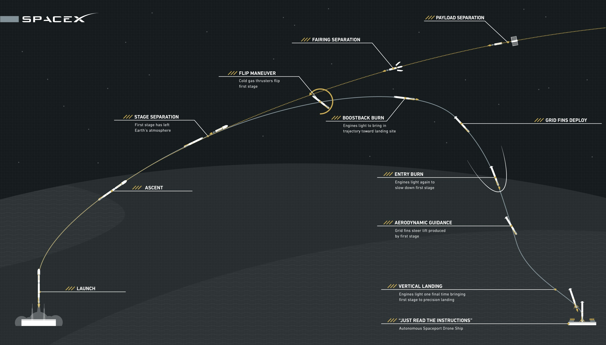

# Apogee

**Apogee** is a high-fidelity rocket ascent + orbit validation platform for a two-stage vehicle reaching a circular low Earth orbit (LEO), with explicit event handling (pitch-over, staging, cutoff), variable-mass dynamics, non-constant gravity, USSA76 atmosphere, and aerodynamic drag.

> Focus: **physics correctness + reproducible numerical methods** (adaptive Runge–Kutta + root-finding shooting), with strict separation between core physics and API/UI adapters.

---

## Overview

The reference launch model is a planar (2D) Earth-centered polar ascent in the equatorial plane.

Fixed design constraints (by requirement):

1. **No Earth rotation** (inertial Earth is non-rotating).
2. **Equatorial launch geometry** (inclination $0^\circ$ in this simplified planar model).
3. **Three guidance phases**:
   - vertical ascent
   - pitch-over kick
   - gravity turn with thrust aligned to velocity ($\alpha=0$)


Reference figures (from `docs/`):


### Reference vehicle context (Falcon 9)




---

## Technical goals

- Deterministic physics engine with **continuous state** + **discrete events** (pitch-over, burnout, separation, cutoff).
- Adaptive Runge–Kutta integration + event detection (no fixed-step hacks).
- Atmosphere via **U.S. Standard Atmosphere 1976 (USSA76)**.
- Structured telemetry output (JSON) for downstream UI/visualization.
- Clean architecture monorepo:
  - pure math in core packages
  - FastAPI as a thin adapter
  - WebGL frontend consuming JSON

---

## Architecture (high level)

- **Core packages (`packages/`)**
  - `apogee-core`: ascent ODEs, events, variable-mass dynamics (pure math)
  - `apogee-orbit`: orbital mechanics diagnostics (energy, $a,e,r_{apo},r_{peri}$)
  - `apogee-atmos`: USSA76 wrapper (`rho(h)`, `a_s(h)`)
  - `apogee-guidance`: guidance laws (angles only)

- **API service (`services/apogee-api/`)**
  - FastAPI input validation + calling packages + JSON serialization

- **Frontend (`frontend/apogee-ui/`)**
  - JSON consumer + interpolation + visualization (Three.js/WebGL)

---

## Launch math (implementation reference)

This section mirrors the definitions in `docs/nm_final_project.tex` and is the authoritative reference for the ascent model.

### Mission input

Single mission input is the target circular orbit altitude $h_{\text{target}}$ (MSL):

$$r_{\text{target}} = R_E + h_{\text{target}}$$

### Earth constants

- $R_E = 6\,371\,000\ \mathrm{m}$
- $\mu = 3.986004418\times 10^{14}\ \mathrm{m^3/s^2}$
- $g_0 = 9.80665\ \mathrm{m/s^2}$

Non-constant gravity:

$$g(r)=\frac{\mu}{r^2}$$

Circular speed at radius $r$:

$$v_{\text{circ}}(r)=\sqrt{\frac{\mu}{r}}$$

### State, coordinates, and kinematics

Planar Earth-centered polar geometry (equatorial plane):

- $r(t)$: geocentric radius
- $h(t)=r(t)-R_E$: altitude
- $\lambda(t)$: downrange central angle (rad)
- $x(t)=R_E\lambda(t)$: surface arc-length downrange (m)
- $v(t)$: speed magnitude
- $\gamma(t)$: flight-path angle measured from local horizontal (rad)

State vector:

$$\mathbf{y}(t)=\begin{bmatrix} r \\ \lambda \\ v \\ \gamma \\ m \end{bmatrix}$$

Kinematics:

$$\dot r=v\sin\gamma$$

$$\dot\lambda=\frac{v\cos\gamma}{r}$$

### Atmosphere + drag

USSA76 provides density $\rho(h)$ and (optionally) speed of sound $a_s(h)$.

Mach number:

$$M=\frac{v}{a_s(h)}$$

Drag magnitude:

$$D=\frac{1}{2}\,\rho(h)\,C_D(M)\,A_{\text{ref}}\,v^2$$


### Thrust direction and variable mass

Angle of attack $\alpha$ is defined between thrust direction and velocity direction.

Mass flow during burn:

$$\dot m=-\frac{T}{I_{sp}g_0}$$


### Final ODE system

With thrust magnitude $T$ and drag magnitude $D$:

$$\dot r = v\sin\gamma$$

$$\dot\lambda = \frac{v\cos\gamma}{r}$$

$$\dot v = \frac{T}{m}\cos\alpha-\frac{D}{m}-\frac{\mu}{r^2}\sin\gamma$$

$$\dot\gamma = \frac{T}{mv}\sin\alpha+\left(\frac{v}{r}-\frac{\mu}{r^2v}\right)\cos\gamma$$

$$\dot m = -\frac{T}{I_{sp}g_0}$$

Gravity turn guidance enforces thrust aligned to velocity:

$$\alpha=0$$

### Hybrid events (explicit)

**Vertical ascent termination** (hold $\gamma=\pi/2$) until:

$$g_{po}(\mathbf{y})=(r-R_E)-h_{po}=0$$

**Pitch-over kick** (instantaneous reset):

$$\gamma(t_{po}^+)=\frac{\pi}{2}-\theta_0$$

**Stage 1 burnout** (event):

$$g_{\text{S1}}(\mathbf{y})=m-m_{1,\text{end}}=0$$

**Stage separation** (mass reset):

$$m^+=m^- - m_{1,\text{dry}}$$

**Final cutoff (SECO/MECO)** (choose $m_{\text{cut}}$ and set $T\leftarrow 0$) when:

$$g_{\text{cut}}(\mathbf{y})=m-m_{\text{cut}}=0$$

---

## Orbit validation (two-body)

At cutoff, compute specific mechanical energy and specific angular momentum:

$$\varepsilon=\frac{v^2}{2}-\frac{\mu}{r}$$

$$h_{\text{ang}}=rv\cos\gamma$$

Then:

$$e=\sqrt{1+\frac{2\varepsilon h_{\text{ang}}^2}{\mu^2}}$$

$$a=-\frac{\mu}{2\varepsilon}$$

$$r_{\text{apo}}=a(1+e),\qquad r_{\text{peri}}=a(1-e)$$

---

## Numerical methodology (shooting)

Per mission, solve for the decision variables:

$$\mathbf{u}=\begin{bmatrix}\theta_0\\m_{\text{cut}}\end{bmatrix}$$

Residuals targeting circular insertion at $r_{\text{target}}$:

$$F_1(\mathbf{u})=r_{\text{cut}}(\mathbf{u})-r_{\text{target}}$$

$$F_2(\mathbf{u})=v_{\text{cut}}(\mathbf{u})-\sqrt{\frac{\mu}{r_{\text{target}}}}$$

Integrate the ODEs with adaptive Runge–Kutta (e.g., Dopri5/Tsit5) and explicit event detection; solve the 2D root-finding problem with a robust nonlinear solver.

---

## Solar pointing & yaw steering (efficiency)

Incidence-based efficiency via dot product:
- $\eta = \max(0,\ \hat{\mathbf{n}}\cdot\hat{\mathbf{s}})$

Where:
- $\hat{\mathbf{n}}$ is the panel normal (spacecraft/body frame),
- $\hat{\mathbf{s}}$ is the Sun direction (inertial, or transformed).

Two-angle simplified control:
- **Yaw** $\psi$: spacecraft rotation around the body Z / nadir axis (convention defined in code).
- **Panel pitch** $\phi$: solar array drive mechanism rotation.

Rotation composition (convention to be fixed in implementation):
- $\hat{\mathbf{n}}(\psi,\phi)=R_y(\phi)\ R_z(\psi)\ \hat{\mathbf{n}}_0$

---

## Telemetry outputs

The simulator produces time series exportable as **JSON** (and consumable by the frontend), e.g.:

- `time_s`
- `x_m`, `y_m` (and optional `z_m`)
- `vx_mps`, `vy_mps` (and optional `vz_mps`)
- `altitude_m`
- `speed_mps`
- `ax_mps2`, `ay_mps2` (and optional `az_mps2`)
- `mass_kg`
- `q_pa` (dynamic pressure)
- `stage_index`
- `solar_efficiency` ($\eta$)
- optional: `yaw_rad`, `panel_pitch_rad`

---

## Repository layout

> Structure may evolve; the intent is to separate physics, solver, models, and the web layer.

```text
apogee/
  packages/
    apogee-core/        # rocket ascent physics (pure math)
    apogee-orbit/       # orbital mechanics & propagation
    apogee-guidance/    # yaw steering, sun-pointing, optimization
    apogee-atmos/       # atmosphere models (USSA76 wrapper)
  services/
    apogee-api/         # FastAPI backend ONLY
  frontend/
    apogee-ui/          # Three.js / WebGL frontend
  experiments/          # notebooks, prototypes (non-production)
  docs/                 # LaTeX, derivations, reports
  scripts/              # CI / automation utilities
  pyproject.toml
  uv.lock
```

---

## Running (Docker)

- `docker compose up --build`
- Backend: `http://localhost:8000` (FastAPI)
- Frontend: `http://localhost:3000` (React)

> Endpoint contracts will be documented alongside the implementation (FastAPI OpenAPI/Swagger).

---

## References

### Project derivations

- [`docs/nm_final_project.tex`](docs/nm_final_project.tex)
- [`docs/nm_final_project.pdf`](docs/nm_final_project.pdf)
- [`docs/final_project_nm.pdf`](docs/final_project_nm.pdf)

### IEEE references 

[1] SpaceX, “Falcon User’s Guide,” May 9, 2025. [Online]. Available: <https://www.spacex.com/assets/media/falcon-users-guide-2025-05-09.pdf>. Accessed: 2026-01-10.

[2] SpaceX, “Falcon 9,” (vehicle overview page). [Online]. Available: <https://www.spacex.com/vehicles/falcon-9/>. Accessed: 2026-01-10.

[3] NASA, “U.S. Standard Atmosphere, 1976 (NASA-TM-X-74335),” 1976. [Online]. Available: <https://ntrs.nasa.gov/api/citations/19770009539/downloads/19770009539.pdf>. Accessed: 2026-01-10.

[4] PyPI, “ussa1976.” [Online]. Available: <https://pypi.org/project/ussa1976/>. Accessed: 2026-01-10.

[5] USSA1976 Documentation, “The U.S. Standard Atmosphere 1976 model.” [Online]. Available: <https://ussa1976.readthedocs.io/>. Accessed: 2026-01-10.

## Engineering standards (recommended)

- **Strict type hints** (e.g., `mypy --strict`)
- Lint/format: `ruff`
- Tests: `pytest` (validate RK4 on reference problems: harmonic oscillator, ideal circular orbit)
- Reproducibility: fixed seeds if stochastic perturbations are added later

---

## Technical roadmap

1. Implement `apogee-atmos` USSA76 wrapper (`rho(h)`, `a_s(h)`), with unit tests.
2. Implement `apogee-core` ascent ODE RHS + explicit events (pitch-over, staging, cutoff).
3. Implement `apogee-orbit` orbit diagnostics ($\varepsilon$, $h_{\text{ang}}$, $a,e,r_{apo},r_{peri}$).
4. Implement mission shooting (solve $[\theta_0, m_{\text{cut}}]$ for circular insertion) with adaptive RK + event detection.
5. Add `apogee-api` adapters (validation + JSON I/O) and `apogee-ui` visualization consuming JSON.
