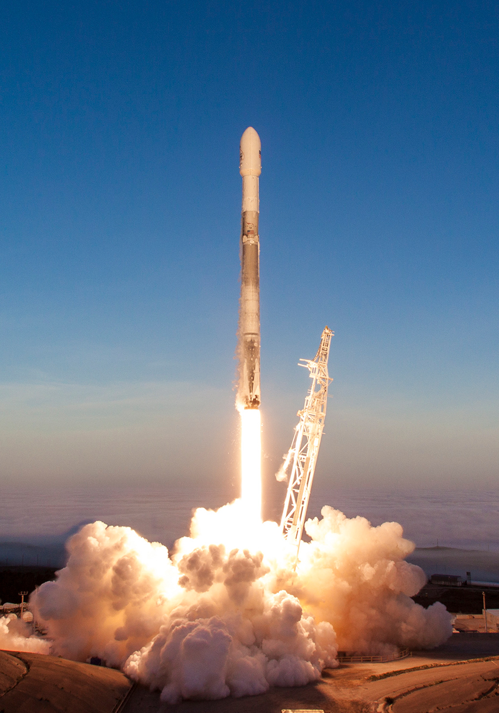
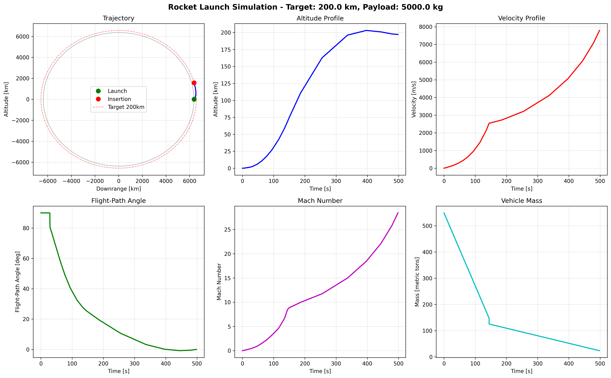
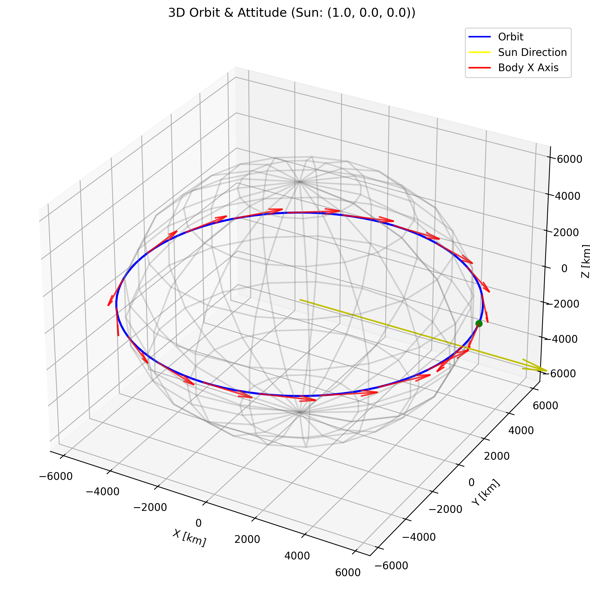

# Apogee

**A two-stage rocket ascent simulator with shooting-method optimization for circular Low Earth Orbit (LEO) insertion.**

<p align="center">
  
</p>

## Project Overview

Apogee is a comprehensive space mission simulator designed to model the complete lifecycle of a satellite deployment mission:

1. **Rocket Launch & Ascent** (✅ Implemented)
   - Two-stage rocket simulation 
   - Shooting method optimization for circular orbit insertion
   - Target altitudes: 160–400 km LEO
   - Payload capacity: 0–10,000 kg

2. **Orbital Insertion** (✅ Implemented)
   - Optimization for minimal eccentricity orbits
   - Two-body orbital diagnostics (apoapsis, periapsis, energy, angular momentum)

3. **Orbital Propagation & Attitude Control** (✅ Implemented - `apogee-orbit`)
   - Circular equatorial orbit propagation
   - Yaw steering optimization for solar panel orientation
   - Real-time sun vector support for interactive 3D visualization
   - CLI and REST API endpoints

4. **3D Visualization** (🚧 In Progress - `frontend`)
   - Real-time launch trajectory visualization (✅ Implemented)
   - Stage separation rendering (✅ Implemented)
   - Multi-mode camera system with free OrbitControls (✅ Implemented)
   - Propulsion and separation effects (✅ Implemented)
   - Orbital path rendering (🔄 Future)
   - Satellite attitude animation (🔄 Future)

### Design Philosophy

The implementation is designed to be:

- **Mathematically rigorous**: Every equation is explicitly derived and mapped to code
- **Numerically robust**: Adaptive RK integration, event root-finding, bounded optimization
- **Physically accurate**: USSA76 atmosphere, variable mass dynamics, non-constant gravity
- **Production-ready**: JSON-serializable output, FastAPI backend, modular architecture
- **Extensible**: Clean separation between physics engine, simulators, and API layers
## Getting Started

Never used Apogee? Start here.  
Learn how to install Apogee and run your first simulation.  
[docs/content/getting-started/index.md](docs/content/getting-started/index.md)

## Architecture

The project follows a monorepo architecture using *uv workspaces* to manage multiple related Python packages in a single repository.  
Each package is responsible for a specific part of the system (physics engine, launch simulation, orbital mechanics, and API), which improves modularity, maintainability, and code reuse.

The full architecture description is available at:  
[docs/content/getting-started/architecture.md](docs/content/getting-started/architecture.md)

## Installation

Detailed installation instructions are available at:  
[docs/content/getting-started/installation.md](docs/content/getting-started/installation.md)

## Quick Start

Already installed? Learn how to use Apogee.  
A hands-on guide to running your first launch simulation and understanding the output.  
[docs/content/getting-started/quickstart.md](docs/content/getting-started/quickstart.md)

### Dependency Flow

```text
Frontend (Three.js / React Three Fiber) [Launch implemented]
    ↓
apogee-api (FastAPI)
    ↓
apogee-launch + apogee-orbit
    ↓
apogee-physics (JAX/Diffrax)
```

**Design principle**: Each layer consumes the layer below directly. No logic duplication.

### Frontend (`frontend/`)

The frontend is a React + React Three Fiber application that renders the launch scene and plays back the backend trajectory data.

**Workflow (npm):**

```bash
cd frontend
npm install
npm run dev
```

**Key implemented features:**

- Stage separation rendering (full rocket before sep, stage1 falling + stage2 continuing after sep)
- Multi-mode camera system using OrbitControls (free rotate/zoom across modes)
- Onboard camera aligned tip-to-tail with a slight side offset
- Propulsion and separation effects sized by stage/thrust/altitude

Detailed frontend documentation is available at:

- Architecture: [docs/content/frontend/architecture.md](docs\content\frontend\architecture.md)  
- Components: [docs/content/frontend/components.md](docs\content\frontend\components.md)  
- Overview: [docs/content/frontend/index.md](docs\content\frontend\index.md)

## Mathematical Formulation

The complete mathematical theory and detailed derivations are documented in:  
[Theory Documentation](docs/content/theory)

A high-level summary of the theory is available in:  
[Theory Index](docs/content/theory/index.md)

It's used:

### State Vector

The rocket state is described in **planar polar coordinates** in an inertial reference frame:

$$
\mathbf{y}(t) =
\begin{bmatrix}
r(t) \\
\lambda(t) \\
v(t) \\
\gamma(t) \\
m(t)
\end{bmatrix}
$$

Detailed derivation:  
[State Vector Theory](docs/content/theory/state-vector.md)

---

### Equations of Motion

The rocket dynamics are modeled using classical mechanics for a variable-mass system in planar polar coordinates.  
The formulation includes kinematics, force balances, mass flow, and special flight regimes.

It covers:

- **Kinematics** (radial and angular motion)  
- **Force analysis** (thrust, drag, and gravity)  
- **Newton’s second law** in path coordinates  
- **Mass flow equation** (Tsiolkovsky rocket equation)  
- **Numerical regularization** (singularity treatment and safety guards)  
- **Special cases** (vertical ascent, gravity turn, and coast)  
- **Final ODE system** for numerical integration  

Full formulation:  
[Equations of Motion Theory](docs/content/theory)

---

### Atmosphere Model

The atmospheric model provides altitude-dependent properties such as air density and speed of sound.  
These quantities are required to compute aerodynamic forces, Mach number, and dynamic pressure during ascent.

More details:  
[Atmosphere Model Theory](docs/content/theory/atmosphere.md)

---

### Flight Phases

The ascent is modeled as a **hybrid dynamical system** composed of multiple flight phases with different dynamics and control laws.  
Phase transitions are triggered by physical events such as pitchover, stage separation, and fuel depletion.

Included phases:

- **Phase A:** Vertical ascent  
- **Phase B:** Stage-1 gravity turn  
- **Phase C:** Coast phase  
- **Phase D:** Stage-2 burn  
- Event detection and transition handling  
- Hybrid system implementation  

Full description:  
[Hybrid Flight Phases Theory](docs/content/theory/flight-phases.md)

---

### Orbital Mechanics

The orbital mechanics module evaluates the post-burn trajectory using the classical **two-body problem** formulation.  
It computes orbital parameters to determine whether the achieved orbit satisfies the target conditions.

Analysis steps:

- **Specific orbital energy**  
- **Specific angular momentum**  
- **Orbital eccentricity**  
- **Semi-major axis**  
- **Apoapsis and periapsis altitudes**

From these quantities, the simulator derives the final orbital elements and insertion quality metrics.

Detailed theory:  
[Orbital Mechanics Theory](docs/content/theory/orbital-mechanics.md)

#### Satellite State

Position in ECI for circular equatorial orbit:

$$\mathbf{r}(t) = r \begin{bmatrix} \cos(\nu) \\ \sin(\nu) \\ 0 \end{bmatrix}$$

Where:
- $r = a$ (semi-major axis from launch)
- $\nu = \nu_0 + n \cdot t$ (true anomaly)
- $n = \sqrt{\mu/r^3}$ (mean motion)
- $\nu_0$ (initial anomaly from launch trajectory $\lambda_{final}$)

**Orbital period:**

$$T = \frac{2\pi}{n} = 2\pi \sqrt{\frac{r^3}{\mu}}$$

**Implementation**: `apogee_orbit/core.py::EquatorialOrbit`

#### LVLH Basis Vectors

For equatorial orbit at true anomaly $\nu$:

$$\mathbf{x}_L = \begin{bmatrix} -\sin(\nu) \\ \cos(\nu) \\ 0 \end{bmatrix}, \quad
\mathbf{y}_L = \begin{bmatrix} 0 \\ 0 \\ -1 \end{bmatrix}, \quad
\mathbf{z}_L = \begin{bmatrix} -\cos(\nu) \\ -\sin(\nu) \\ 0 \end{bmatrix}$$

**Implementation**: `apogee_orbit/core.py::EquatorialOrbit.get_lvlh_basis`

#### Yaw Steering Algorithm

The sun vector $\mathbf{s}_{ECI}$ (arbitrary unit vector) is transformed to LVLH frame:

$$\mathbf{s}_{local} = \begin{bmatrix} \mathbf{s} \cdot \mathbf{x}_L \\ \mathbf{s} \cdot \mathbf{y}_L \\ \mathbf{s} \cdot \mathbf{z}_L \end{bmatrix}$$

**Yaw angle** (rotation about nadir axis):

$$\psi = \arctan2(s_{y,local}, s_{x,local})$$

This control law rotates the spacecraft body frame such that the sun vector lies in the Body X-Z plane, allowing solar panels (rotating about Body Y) to track the sun optimally.

**Beta angle** (sun elevation above orbital plane):

$$\beta = \arcsin(-s_{y,local})$$

For equatorial orbits with sun in the equatorial plane, $\beta \approx 0$.

**Implementation**: `apogee_orbit/attitude.py::calculate_yaw_steering`

#### Physical Interpretation

| Condition | Yaw Angle | Meaning |
|-----------|-----------|---------|
| Sun ahead of velocity | $\psi = 0°$ | Satellite "faces forward" |
| Sun behind velocity | $\psi = 180°$ | Satellite "faces backward" |
| Sun at ±90° | $\psi = ±90°$ | Satellite rotates sideways |

The yaw profile exhibits characteristic **180° flips** when the sun crosses the velocity/anti-velocity boundary (at $\nu = 0°$ and $\nu = 180°$ for sun at $+X$).


### Shooting Method for Circular Orbit Insertion

The circular orbit insertion problem is formulated as a **nonlinear root-finding problem**:

**Decision variables (control vector):**

$$\mathbf{u} = \begin{bmatrix} \theta_0 \\ t_{coast} \\ t_{burn2} \\ \alpha_2 \end{bmatrix}$$

Where:
- **$\theta_0$**: Initial pitch-over angle [deg]
- **$t_{coast}$**: Coast phase duration [s]
- **$t_{burn2}$**: Stage-2 burn time [s]
- **$\alpha_2$**: Stage-2 steering angle [rad]

**Residual function:**

$$\mathbf{F}(\mathbf{u}) = \begin{bmatrix} \frac{a(\mathbf{u}) - r_{target}}{r_{target}} \\ e(\mathbf{u}) \\ \gamma(\mathbf{u}) \end{bmatrix}$$

**Goal**: Find $\mathbf{u}^*$ such that $\mathbf{F}(\mathbf{u}^*) \approx \mathbf{0}$

This ensures:
1. Semi-major axis matches target radius: $a = r_{target}$
2. Orbit is circular: $e = 0$
3. Insertion is tangent: $\gamma = 0$

**Implementation**: `apogee_physics/shooting.py::solve_circular_orbit`

### Optimization Algorithm

The solver uses a **hybrid Levenberg-Marquardt + Broyden method**:

#### 1. Bound Constraints via Logistic Re-parameterization

Physical bounds are enforced:

$$\theta_0 \in [\theta_{min}, \theta_{max}]$$
$$t_{coast} \in [0, 200] \text{ s}$$
$$t_{burn2} \in [50, 450] \text{ s}$$
$$\alpha_2 \in [\alpha_{min}, \alpha_{max}]$$

Introduce unconstrained variables $\mathbf{x} \in \mathbb{R}^4$:

$$u_i(x_i) = u_{i,min} + (u_{i,max} - u_{i,min}) \cdot \sigma(x_i)$$

$$\sigma(x) = \frac{1}{1 + e^{-x}} \quad \text{(logistic function)}$$

**Implementation**: `apogee_physics/shooting.py::_u_from_x`, `_x_from_u`

#### 2. Finite-Difference Jacobian

Compute Jacobian $\mathbf{J} = \frac{\partial \mathbf{F}}{\partial \mathbf{x}}$ using forward differences:

$$\mathbf{J}_{:,i} \approx \frac{\mathbf{F}(\mathbf{x} + \Delta x_i \mathbf{e}_i) - \mathbf{F}(\mathbf{x})}{\Delta x_i}$$

**Implementation**: `apogee_physics/shooting.py::_fd_jacobian_x`

#### 3. Levenberg-Marquardt Step

At iteration $k$, solve damped normal equations:

$$(\mathbf{J}_k^T \mathbf{J}_k + \lambda_k \mathbf{I}) \Delta\mathbf{x}_k = -\mathbf{J}_k^T \mathbf{F}_k$$

Backtracking line search: try step lengths $\alpha \in \{1, \frac{1}{2}, \frac{1}{4}, \ldots\}$ until:

$$\|\mathbf{F}(\mathbf{x}_k + \alpha \cdot \Delta\mathbf{x}_k)\|_2 < \|\mathbf{F}(\mathbf{x}_k)\|_2$$

**Implementation**: `apogee_physics/shooting.py::_newton`

#### 4. Broyden Rank-1 Update

After accepted step $\mathbf{s} = \mathbf{x}_{k+1} - \mathbf{x}_k$ and $\mathbf{y} = \mathbf{F}_{k+1} - \mathbf{F}_k$:

$$\mathbf{J}_{k+1} = \mathbf{J}_k + \frac{(\mathbf{y} - \mathbf{J}_k \mathbf{s})\mathbf{s}^T}{\mathbf{s}^T \mathbf{s}}$$

This reduces expensive residual evaluations while maintaining superlinear convergence.

**Implementation**: `apogee_physics/shooting.py::_broyden_update`

#### 5. Multistart Strategy

Generate candidate initial guesses from coarse grids over each control variable, score by $\|\mathbf{F}(\mathbf{u}_0)\|_2$, and select best initializations.

**Implementation**: `apogee_physics/shooting.py` (candidate generation)

### ODE Integration

Each flight phase is integrated using:

- **Solver**: Tsitouras 5(4) explicit Runge-Kutta (`diffrax.Tsit5`)
- **Step control**: PID controller with adaptive time-stepping
  - Relative tolerance: `rtol = 1e-6`
  - Absolute tolerance: `atol = 1e-6`
- **Event detection**: Newton root-finding (`optimistix.Newton`)
  - Root relative tolerance: `root_rtol = 1e-6`
  - Root absolute tolerance: `root_atol = 1e-3`
- **Saving**: Initial time + all accepted steps

**Implementation**: `apogee_physics/simulate.py::_solve_segment`

### Numerical Regularizations

#### Guard for 1/v singularity

Near liftoff ($v \to 0$), the $\dot{\gamma}$ equation contains $1/v$. Replace:

$$\frac{1}{v} \quad \to \quad \frac{v}{v^2 + v_\varepsilon^2}$$

Matches $1/v$ for $v \gg v_\varepsilon$, bounded at $v = 0$.

**Implementation**: `apogee_physics/dynamics.py::rhs_general` (variable `inv_v`)

#### Guard for 1/r collapse

Prevent numerical issues if $r$ becomes non-physical:

$$r_{safe} = \max(r, 0.99 \cdot R_E)$$

Use $r_{safe}$ in all denominator terms.

**Implementation**: `apogee_physics/dynamics.py::rhs_general` (variable `r_safe`)

#### Time Monotonicity Enforcement

Adaptive solvers and event boundaries can produce non-increasing time samples. Enforce strict monotonicity:

$$t_{k+1} > t_k \quad \forall k$$

by filtering and applying mask to all derived series.

**Implementation**: `apogee_physics/simulate.py::_strictly_increasing_mask`

## Installation

### Prerequisites

- Python ≥ 3.11
- [uv](https://github.com/astral-sh/uv) package manager

### Install

```bash
# Clone repository
git clone <repository-url>
cd apogee

# Install all packages in editable mode
uv sync
```

This installs all workspace packages with proper dependency resolution:
- `apogee-physics`: JAX, Diffrax, ussa1976
- `apogee-launch`: Typer, apogee-physics
- `apogee-orbit`: (placeholder)
- `apogee-api`: FastAPI, Uvicorn, Pydantic, apogee-launch
### Install Specific Package

```bash
uv sync --package apogee-launch
```

## Usage

### Command-Line Interface

Run launch simulations from the terminal:

```bash
# Full trajectory output
uv run apogee-launch --h-target-km 213 --payload-kg 4082

# Summary only (faster, no trajectory arrays)
uv run apogee-launch --h-target-km 213 --payload-kg 4082 --no-trajectory

# Custom initial guesses for shooting solver
uv run apogee-launch --h-target-km 200 --payload-kg 5000 \
  --theta0-deg 8.0 --t-coast 50.0 --t-burn2 300.0

# Pipe to jq for pretty JSON
uv run apogee-launch --h-target-km 213 --payload-kg 4082 --no-trajectory | jq

# Generate all plots automatically
uv run apogee-launch --h-target-km 213 --payload-kg 4082 --plot
```

**Required parameters:**
- `--h-target-km`: Target altitude [160, 400] km
- `--payload-kg`: Payload mass [0, 10000] kg

**Optional parameters:**
- `--theta0-deg`: Initial pitch-over angle [deg]
- `--t-coast`: Coast duration [s]
- `--t-burn2`: Stage-2 burn time [s]
- `--no-trajectory`: Exclude trajectory arrays from output
- `--plot`: Generate all plots and save to `plots/` directory

#### Plot Generation

The `--plot` flag automatically generates comprehensive visualization of the launch trajectory:

```bash
# Generate all plots (trajectory, time series, dynamics, mass, comprehensive)
uv run apogee-launch --h-target-km 213 --payload-kg 4082 --plot
```

This creates a `plots/` directory with the following files:
- `trajectory.png`: 2D trajectory with Earth surface and target altitude circle
- `time.png`: Altitude, velocity, and flight-path angle vs time
- `dynamics.png`: Mach number and drag force vs time
- `mass.png`: Vehicle mass profile showing fuel consumption
- `comprehensive.png`: 6-panel overview with all key parameters

All plots are displayed interactively and saved as high-resolution PNG files. Use `--verbose` to see plot generation progress and `--debug` for detailed file saving information.

<p align="center">
  
</p>

### Orbit CLI (`apogee-orbit`)

Calculate yaw steering for orbital phase:

```bash
# Full simulation: launch + orbit (one full orbit)
uv run apogee-orbit --h-target-km 200 --payload-kg 5000

# Custom sun vector (ECI frame)
uv run apogee-orbit --h-target-km 200 --payload-kg 5000 --sun-x 0.7 --sun-y 0.7 --sun-z 0

# Simulate 2 orbits with 360 output points
uv run apogee-orbit --h-target-km 200 --payload-kg 5000 -t 10600 -n 360

# Generate plots (Yaw profile + 3D visualization)
uv run apogee-orbit --h-target-km 200 --payload-kg 5000 --plot

# Standalone mode (skip launch, use existing orbital params)
uv run apogee-orbit --r-m 6570000 --nu-initial-deg 15 --plot
```

**Full simulation parameters:**
- `--h-target-km`: Target altitude [160, 400] km (triggers launch simulation)
- `--payload-kg`: Payload mass [0, 10000] kg

**Standalone parameters:**
- `--r-m`: Orbital radius [m] (skips launch simulation)
- `--nu-initial-deg`: Initial true anomaly [deg]

**Sun vector:**
- `--sun-x`, `--sun-y`, `--sun-z`: Sun direction in ECI frame (default: 1, 0, 0)

**Time control:**
- `-t, --t-duration`: Simulation duration [s] (default: one orbit)
- `-n, --n-points`: Number of output points (default: 100)

**Output options:**
- `--plot`: Generate Yaw profile and 3D visualization plots
- `-v, --verbose`: Enable verbose logging
- `--debug`: Enable debug logging

<p align="center">
  
</p>

#### JSON Output Schema

```json
{
  "schema_version": 1,
  "inputs": {
    "h_target_km": 213.0,
    "payload_kg": 4082.0
  },
  "optimal_numerics": {
    "theta0_rad": 0.154686,
    "t_coast_s": 5.276867,
    "t_burn2_s": 351.421985,
    "alpha2_rad": 0.113204
  },
  "summary": {
    "ecc": 0.000498,
    "h_err_m": -1644.615,
    "v_err_mps": 1.829968,
    "gamma_deg": -0.025611
  },
  "trajectory": {
    "t_s": [...],
    "r_m": [...],
    "h_m": [...],
    "lambda_rad": [...],
    "v_mps": [...],
    "gamma_rad": [...],
    "m_kg": [...],
    "q_pa": [...],
    "mach": [...],
    "drag_n": [...],
    "pos_m": {"x": [...], "y": [...], "z": [...]},
    "vel_mps": {"x": [...], "y": [...], "z": [...]},
    "orbit": {...}
  }
}
```

All arrays have **explicit unit suffixes** for clarity.

### Python API

Import and use directly in Python scripts:

```python
from apogee_launch import solve_to_circular_orbit

# Run simulation
result = solve_to_circular_orbit(
    h_target_km=213.0,
    payload_kg=4082.0,
    include_trajectory=True,
    trim=True,  # Remove pre-pitchover vertical phase
)

```

**Available functions:**
- `solve_to_circular_orbit()`: Full shooting method optimization
- `simulate_to_orbit()`: Single simulation with given control parameters

### Python API Example with Plotting

```python
from apogee_launch import solve_to_circular_orbit

# Run simulation
result = solve_to_circular_orbit(
    h_target_km=213.0,
    payload_kg=4082.0,
    include_trajectory=True,
    trim=True,  # Remove pre-pitchover vertical phase
)

# Access results
print(f"Eccentricity: {result.summary['ecc']:.6f}")
print(f"Altitude error: {result.summary['h_err_m']:.1f} m")
print(f"Velocity error: {result.summary['v_err_mps']:.3f} m/s")
print(f"Flight-path angle: {result.summary['gamma_deg']:.4f}°")

# Optimal control parameters
print(f"\nOptimal numerics:")
print(f"  θ₀ = {result.optimal_numerics['theta0_rad']:.4f} rad")
print(f"  t_coast = {result.optimal_numerics['t_coast_s']:.2f} s")
print(f"  t_burn2 = {result.optimal_numerics['t_burn2_s']:.2f} s")
print(f"  α₂ = {result.optimal_numerics['alpha2_rad']:.4f} rad")

# Generate plots programmatically
if result.trajectory:
    from apogee_launch.plotting import plot_comprehensive
    
    mission_params = {
        "h_target_km": 213.0,
        "payload_kg": 4082.0,
    }
    
    fig = plot_comprehensive(result.trajectory, mission_params)
    fig.savefig("my_launch_plot.png", dpi=300, bbox_inches='tight')
    fig.show()
```

### Manual Trajectory Plotting

For custom plotting, you can access the trajectory data directly:

```python
# Trajectory data (if included)
if result.trajectory:
    import matplotlib.pyplot as plt
    
    t = result.trajectory['t_s']
    h = result.trajectory['h_m']
    v = result.trajectory['v_mps']
    
    plt.figure(figsize=(12, 4))
    plt.subplot(1, 2, 1)
    plt.plot(t, h/1000)
    plt.xlabel('Time [s]')
    plt.ylabel('Altitude [km]')
    plt.grid(True)
    
    plt.subplot(1, 2, 2)
    plt.plot(t, v)
    plt.xlabel('Time [s]')
    plt.ylabel('Velocity [m/s]')
    plt.grid(True)
    
    plt.tight_layout()
    plt.show()
```

### Frontend Integration Workflow

The API is designed for a **Three.js 3D frontend** with real-time interactivity:

```
┌─────────────────────────────────────────────────────────────────────────────┐
│                           FRONTEND WORKFLOW                                  │
├─────────────────────────────────────────────────────────────────────────────┤
│                                                                             │
│  1. User clicks "Launch"                                                    │
│     │                                                                       │
│     ▼                                                                       │
│  ┌─────────────────────────────────────────┐                               │
│  │  POST /launch/simulate                  │  ← ~20 seconds                │
│  │  {h_target_km: 200, payload_kg: 5000}   │                               │
│  └─────────────────────────────────────────┘                               │
│     │                                                                       │
│     │  Response contains:                                                   │
│     │  • trajectory.orbit.semi_major_axis  → r_m                           │
│     │  • trajectory.lambda_rad[-1]         → nu_initial_rad                │
│     │                                                                       │
│     ▼                                                                       │
│  Frontend renders 3D rocket launch animation                               │
│     │                                                                       │
│     ▼                                                                       │
│  2. Immediately request orbit trajectory                                    │
│     │                                                                       │
│     ▼                                                                       │
│  ┌─────────────────────────────────────────┐                               │
│  │  POST /orbit/trajectory                 │  ← ~100 milliseconds          │
│  │  {r_m, nu_initial_rad, sun_x/y/z}       │                               │
│  └─────────────────────────────────────────┘                               │
│     │                                                                       │
│     │  Response contains:                                                   │
│     │  • trajectory.x_m, y_m, z_m arrays   → 3D orbit path                 │
│     │  • yaw_steering.yaw_deg array        → satellite orientations        │
│     │                                                                       │
│     ▼                                                                       │
│  Frontend renders 3D orbit with satellite animation                        │
│     │                                                                       │
│     ▼                                                                       │
│  3. User drags sun in 3D scene                                             │
│     │                                                                       │
│     ▼                                                                       │
│  ┌─────────────────────────────────────────┐                               │
│  │  POST /orbit/yaw                        │  ← <5 milliseconds            │
│  │  {r_m, nu_initial_rad, sun_x/y/z, t_s}  │    (call on each drag event) │
│  └─────────────────────────────────────────┘                               │
│     │                                                                       │
│     │  Response contains:                                                   │
│     │  • yaw_deg, beta_deg                 → instant attitude update       │
│     │  • satellite_position                → current 3D position           │
│     │                                                                       │
│     ▼                                                                       │
│  Frontend updates satellite rotation in real-time                          │
│                                                                             │
└─────────────────────────────────────────────────────────────────────────────┘
```

**Key Design Decisions:**
- **Stateless API**: Frontend caches `r_m` and `nu_initial_rad` from launch response
- **Separation of concerns**: Slow launch (~20s) vs fast yaw updates (<5ms)
- **Real-time ready**: `/orbit/yaw` is optimized for 60 FPS UI interaction

### REST API (FastAPI)

Start the development server:

```bash
# Development mode with auto-reload
uv run uvicorn apogee_api.main:app --reload

# Production mode
uv run uvicorn apogee_api.main:app --host 0.0.0.0 --port 8000 --workers 4
```

#### Endpoints

**Health Check:**
```bash
GET http://localhost:8000/health
```

Response:
```json
{"status": "ok", "service": "apogee-api"}
```

**Launch Simulation:**
```bash
POST http://localhost:8000/launch/simulate
Content-Type: application/json

{
  "h_target_km": 213,
  "payload_kg": 4082,
  "include_trajectory": false,
  "theta0_deg": 8.0,  // optional
  "t_coast_s": 50.0,  // optional
  "t_burn2_s": 300.0  // optional
}
```

Response: Same JSON schema as CLI output

**Example with curl:**
```bash
curl -X POST "http://localhost:8000/launch/simulate" \
  -H "Content-Type: application/json" \
  -d '{
    "h_target_km": 213,
    "payload_kg": 4082,
    "include_trajectory": false
  }' | jq
```

**Interactive documentation:**
- Swagger UI: http://localhost:8000/docs
- ReDoc: http://localhost:8000/redoc

**Orbit Trajectory:**
```bash
POST http://localhost:8000/orbit/trajectory
Content-Type: application/json

{
  "r_m": 6570000,
  "nu_initial_rad": 0.242,
  "sun_x": 1.0,
  "sun_y": 0.0,
  "sun_z": 0.0,
  "n_points": 100
}
```

Response includes 3D trajectory (`x_m`, `y_m`, `z_m` arrays) and yaw steering profile (`yaw_rad`, `yaw_deg`, `beta_rad`, `beta_deg` arrays).

**Yaw Instant (Fast, <5ms):**
```bash
POST http://localhost:8000/orbit/yaw
Content-Type: application/json

{
  "r_m": 6570000,
  "nu_initial_rad": 0.242,
  "sun_x": 1.0,
  "sun_y": 0.0,
  "sun_z": 0.0,
  "t_s": 0
}
```

Response:
```json
{
  "yaw_rad": 3.14159,
  "yaw_deg": 180.0,
  "beta_rad": 0.0,
  "beta_deg": 0.0,
  "sun_body": [0.24, 0.0, -0.97],
  "satellite_position": [6378554, 1574466, 0]
}
```

Use `/orbit/yaw` for real-time sun vector updates (e.g., when user drags sun in 3D frontend).

## Logging System

Apogee implements a comprehensive logging system across all layers, with detailed numerical methods diagnostics for academic analysis and debugging.

### Logging Architecture

```
┌─────────────────────────────────────────────────────────────┐
│                    apogee-api (FastAPI)                     │
│  Level: INFO - HTTP requests, response times, errors        │
└─────────────────────────────────────────────────────────────┘
                            ▼
┌─────────────────────────────────────────────────────────────┐
│                   apogee-launch (Simulator)                 │
│  Level: INFO - Simulation start/end, validation, results   │
└─────────────────────────────────────────────────────────────┘
                            ▼
┌─────────────────────────────────────────────────────────────┐
│                  apogee-physics (Core Engine)               │
│  shooting.py - DEBUG/INFO: Iterations, convergence, Jacobian│
│  simulate.py - DEBUG: ODE phases, steps, events            │
└─────────────────────────────────────────────────────────────┘
```

### CLI Logging Modes

**Normal mode (WARNING level):**
```bash
uv run apogee-launch --h-target-km 213 --payload-kg 4082
# Only warnings and errors
```

**Verbose mode (INFO level):**
```bash
uv run apogee-launch --h-target-km 213 --payload-kg 4082 --verbose
# Shows simulation progress and results
```

**Debug mode (DEBUG level):**
```bash
uv run apogee-launch --h-target-km 213 --payload-kg 4082 --debug
# Full numerical methods details: iterations, Jacobian, convergence
```

### Capturing Logs for Analysis

```bash
# Save logs to file (stderr contains logs, stdout contains JSON)
uv run apogee-launch --h-target-km 213 --payload-kg 4082 --debug 2> simulation.log

# View logs in real-time while saving
uv run apogee-launch --h-target-km 213 --payload-kg 4082 --debug 2>&1 | tee simulation.log
```

### What Gets Logged

**Shooting Method (`apogee_physics.shooting`):**
- Multistart strategy: candidate evaluation, feasibility checks
- Each iteration: residual norm, damping parameter (λ)
- Jacobian computation: condition number, finite difference steps
- Broyden updates: rank-1 correction magnitudes
- Line search: step acceptance/rejection, residual reduction
- Convergence: final residual, optimal control parameters
- Failures: bounds violations, fuel depletion, simulation crashes

**ODE Integration (`apogee_physics.simulate`):**
- Phase transitions: vertical ascent → gravity turn → coast → stage 2 burn
- Step counts per phase
- Event detection: pitch-over, stage separation, fuel depletion
- State diagnostics: mass, altitude, velocity at key events

**Launch Simulator (`apogee_launch`):**
- Simulation start with target parameters
- Vehicle configuration: mass budget, burn times
- Optimization progress
- Mission success metrics: eccentricity, altitude/velocity errors

**API Layer (`apogee_api`):**
- HTTP request details
- Execution time tracking
- Error handling with stack traces

### Example Debug Output

```
INFO - Starting launch simulation: h_target=213.0km, payload=4082.0kg
INFO - Multistart: evaluating 2519 candidate initial guesses
INFO - Found 1847 feasible candidates, best initial ||F||=2.456e-02
DEBUG - Attempt 1: initial ||F||=2.456e-02
DEBUG - Initial: u=[8.00deg, 50.0s, 240.0s, 0.00deg], ||F||=2.456234e-02
DEBUG - Computing Jacobian via finite differences
DEBUG - Jacobian: cond(J)=1.23e+02
DEBUG - Iter 1: ||F||=2.456234e-02, lambda=1.000e-02
DEBUG - Step accepted: alpha=1.000, ||F||=1.234567e-02 (reduced by 49.7%)
DEBUG - Broyden rank-1 update: ||s||=1.234e-01, ||y||=5.678e-03
INFO - Converged in 8 iterations, 45 evaluations
INFO - Optimal control found:
INFO -   theta0 = 8.1234 deg
INFO -   t_coast = 52.34 s
INFO -   t_burn2 = 245.67 s
INFO -   alpha2 = 1.2345 deg
INFO - Mission success:
INFO -   Eccentricity: 0.000234
INFO -   Altitude error: 123.4m
INFO -   Velocity error: 0.567m/s
```

### Programmatic Configuration

```python
import logging

# Configure for detailed numerical analysis
logging.basicConfig(
    level=logging.DEBUG,
    format='%(asctime)s - %(name)s - %(levelname)s - %(message)s',
    handlers=[
        logging.FileHandler('numerical_analysis.log'),
        logging.StreamHandler()
    ]
)

# Set specific module levels
logging.getLogger('apogee_physics.shooting').setLevel(logging.DEBUG)
logging.getLogger('apogee_physics.simulate').setLevel(logging.DEBUG)
logging.getLogger('apogee_launch').setLevel(logging.INFO)
```

## Implementation Details

### Falcon 9 v1.2 FT Parameters

The simulator uses official SpaceX Falcon 9 parameters:

```python
# Vehicle parameters (apogee_launch/falcon9.py)
m0 = 549,054 kg          # Gross liftoff mass
thrust1 = 7,686,000 N    # Stage-1 thrust (9 Merlin 1D)
thrust2 = 981,000 N      # Stage-2 thrust (1 Merlin 1D Vac)
isp1 = 282 s             # Stage-1 specific impulse (sea level)
isp2 = 348 s             # Stage-2 specific impulse (vacuum)
t2_burn = 397 s          # Stage-2 burn time
m1_dry = 22,000 kg       # Stage-1 dry mass
m2_dry = 4,000 kg        # Stage-2 dry mass
interstage = 2,000 kg    # Interstage mass
diameter = 3.7 m         # Vehicle diameter
```

**Reference area:** A_ref = π(d/2)²

**Drag coefficient:** C_D = 0.3 (constant, typical for streamlined rocket)

### Technology Stack

**Physics Engine (`apogee-physics`):**
- [JAX](https://github.com/google/jax): Automatic differentiation, JIT compilation
- [Diffrax](https://github.com/patrick-kidger/diffrax): Differential equation solvers
- [Optimistix](https://github.com/patrick-kidger/optimistix): Root-finding for events
- [ussa1976](https://pypi.org/project/ussa1976/): US Standard Atmosphere 1976

**Launch Simulator (`apogee-launch`):**
- [Typer](https://typer.tiangolo.com/): CLI framework

**REST API (`apogee-api`):**
- [FastAPI](https://fastapi.tiangolo.com/): Modern async web framework
- [Uvicorn](https://www.uvicorn.org/): ASGI server
- [Pydantic](https://pydantic-docs.helpmanual.io/): Data validation

### Code-to-Equation Mapping

| Mathematical Object | Implementation |
|---------------------|----------------|
| Atmosphere table & interpolation | `apogee_physics/atmosphere.py` |
| Derived quantities (h, ρ, M, D, q) | `apogee_physics/dynamics.py::compute_derived` |
| ODE right-hand side | `apogee_physics/dynamics.py::rhs_general` |
| Vertical/gravity turn/coast | `rhs_vertical`, `rhs_gravity_turn`, `rhs_coast` |
| Event functions | `apogee_physics/simulate.py::_cond_*` |
| ODE segment solver | `apogee_physics/simulate.py::_solve_segment` |
| Time monotonicity filter | `apogee_physics/simulate.py::_strictly_increasing_mask` |
| Orbital diagnostics (ε, h, a, e) | `apogee_physics/orbit.py::orbit_diagnostics` |
| Shooting residual | `apogee_physics/shooting.py::compute_residuals` |
| LM step + Broyden + line search | `apogee_physics/shooting.py::_newton` |
| Trajectory JSON serialization | `apogee_physics/trajectory.py::trajectory_to_dict` |

### Performance Characteristics

**Typical convergence:**
- Iterations: 5-15 (depending on initial guess quality)
- Time per simulation: ~0.5-2 seconds (first run includes JAX compilation)
- Subsequent runs: ~0.1-0.5 seconds (cached compilation)

**Accuracy:**
- Altitude error: < 2 km (< 1% for 200 km target)
- Velocity error: < 2 m/s (< 0.03% of orbital velocity)
- Eccentricity: < 0.001 (highly circular)
- Flight-path angle: < 0.1° (nearly tangent insertion)

## Future Work

### Phase 3: Orbital Propagation (`apogee-orbit`) ✅ Complete

- [x] Circular equatorial orbit propagator
- [x] LVLH coordinate frame transformations
- [x] Yaw steering optimization for solar panels
- [x] CLI with plotting support
- [x] REST API endpoints (trajectory + instant yaw)

### Phase 4: 3D Visualization (Frontend)

- [x] Three.js scene setup
- [x] Real-time launch trajectory rendering
- [x] Camera controls and viewpoints
- [x] Stage separation rendering
- [ ] Orbital path visualization
- [ ] Satellite attitude animation
- [ ] Earth texture and lighting

**Note:** Trajectory output is already frontend-ready:
- JSON-serializable via `trajectory_to_dict`
- Planar position: `pos_m = {x, y, z}` with z=0
- Compatible with future 3D orbit propagation

## Documentation

**Mathematical formulation:**
- Full derivation: [`docs/nm_final_project.pdf`](docs/nm_final_project.pdf)
- LaTeX source: [`docs/nm_final_project.tex`](docs/nm_final_project.tex)
- Every equation mapped to code implementation

**Development guide:**
- [`DEVELOPMENT.md`](DEVELOPMENT.md): Setup, workflow, best practices

**Visual assets:**
- Falcon 9 reference: `docs/falcon9Rocket.jpg`, `docs/falcon9Trajectory.jpg`
- Diagrams: `docs/2_stages_rocket_launch.png`, `docs/rocketForces.gif`, `docs/variableMass.png`
- Orbital geometry: `docs/general_earth_orbit.png`
