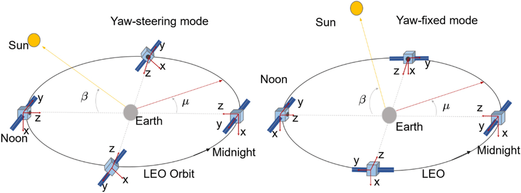

# Apogee

**Apogee** is a flight dynamics and orbital mechanics simulator for a multi-stage rocket, featuring explicit numerical integration (handwritten RK4), an atmosphere model, discrete events (stage separation), and solar-panel pointing efficiency computed via vector algebra.

> Focus: **physics clarity + reproducible numerical methods**, avoiding “black-box” integrators for the core dynamics loop.

---

## Overview

The simulation models a complete mission envelope:

1. **Launch & atmospheric ascent** with thrust, altitude-varying gravity, and aerodynamic drag.
2. **Transition to exo-atmospheric flight** and **Earth-centered orbital dynamics**.
3. **Simplified attitude control** and **solar efficiency** from incidence angle (includes yaw steering).

Reference images (see `resources/`):

  


---

## Technical goals

- Deterministic physics engine with **continuous state** + **discrete events** (multi-staging).
- “From scratch” implementation of **Runge–Kutta 4 (RK4)**.
- Atmosphere based on ISA-like approximations and/or tabulated data + interpolation.
- Structured telemetry output (CSV/JSON) for analysis and visualization.
- Modern stack: **FastAPI** (backend) + **React** (frontend) + **Docker** (reproducibility).

---

## Architecture (high level)

- **Backend (Python / FastAPI)**
  - Runs simulations and exposes telemetry/parameters via API.
  - Centralizes the physics engine, input validation, and export/persistence.

- **Frontend (React)**
  - UI to configure vehicle/stages/profiles and run simulations.
  - Plots: altitude vs time, velocity, dynamic pressure, etc.

- **Infra (Docker / Docker Compose)**
  - Standardizes the runtime environment (dependencies, versions, execution).

---

## Physics model

We integrate translational dynamics (2D or 3D) with a typical state vector:
- State: $\mathbf{y}(t) = [\mathbf{r}(t),\ \mathbf{v}(t),\ m(t)]^\top$
- Kinematics: $\dot{\mathbf{r}} = \mathbf{v}$

Acceleration comes from external forces on a variable-mass vehicle:
- Dynamics: $\dot{\mathbf{v}} = (\mathbf{T} + \mathbf{F}_g + \mathbf{F}_d) / m$

### Gravity (not constant)

Universal gravitation:
- Force: $\mathbf{F}_g = -G M_\oplus m\ \mathbf{r} / \|\mathbf{r}\|^3$
- Acceleration: $\mathbf{a}_g = -\mu\ \mathbf{r} / \|\mathbf{r}\|^3,\ \mu = G M_\oplus$

### Thrust (active stage)

Generic thrust model:
- $\mathbf{T}(t) = T(t)\ \hat{\mathbf{u}}(t)$

Mass flow during burn:
- $\dot{m}(t) = -\dot{m}_{prop}(t)$
- For a stage with $I_{sp}$: $\dot{m}_{prop} \approx T / (I_{sp}\ g_0)$

### Aerodynamic drag

Drag force:
- $\mathbf{F}_d = -\tfrac{1}{2}\rho(h)\ C_d\ A\ \|\mathbf{v}_{rel}\|\ \mathbf{v}_{rel}$

Where $\mathbf{v}_{rel}$ is the velocity relative to the atmosphere (often simplified to $\mathbf{v}$ if winds/rotation are neglected).

Dynamic pressure (telemetry):
- $q = \tfrac{1}{2}\rho(h)\ \|\mathbf{v}_{rel}\|^2$

### Atmosphere (ISA-like approximation)

Simple exponential density:
- $\rho(h) = \rho_0\ e^{-h/H}$

Optionally, use **tabulated ISA data + interpolation** (e.g., spline) for $\rho(h)$, $T(h)$, $p(h)$ over altitude bands.

---

## Multi-staging & discrete events

A vehicle is defined by stages with:
- dry mass, propellant mass
- thrust (constant or profile), $I_{sp}$
- aerodynamic parameters ($C_d$, reference area $A$)
- burn time and/or depletion condition

**Stage separation** is a discrete event: instantaneous mass drop (and parameter changes). To locate events with sub-$\Delta t$ accuracy, the simulator can apply:
- **bisection** or **Newton–Raphson** over an event function $f(t)$ (e.g., remaining propellant mass).

---

## Numerical integration (handwritten RK4)

We solve $\dot{\mathbf{y}}=\mathbf{f}(t,\mathbf{y})$ with step $\Delta t$:

- $k_1 = f(t, y)$  
- $k_2 = f(t+\Delta t/2,\ y+\Delta t\ k_1/2)$  
- $k_3 = f(t+\Delta t/2,\ y+\Delta t\ k_2/2)$  
- $k_4 = f(t+\Delta t,\ y+\Delta t\ k_3)$  
- $y_{n+1} = y_n + (\Delta t/6)\ (k_1 + 2k_2 + 2k_3 + k_4)$

> By design, Apogee avoids `scipy.integrate` for the core integration loop (the goal is explicit, inspectable numerical methods).

---

## Solar pointing & yaw steering (efficiency)

Incidence-based efficiency via dot product:
- $\eta = \max(0,\ \hat{\mathbf{n}}\cdot\hat{\mathbf{s}})$

Where:
- $\hat{\mathbf{n}}$ is the panel normal (spacecraft/body frame),
- $\hat{\mathbf{s}}$ is the Sun direction (inertial, or transformed).

Two-angle simplified control:
- **Yaw** $\psi$: spacecraft rotation around the body Z / nadir axis (convention defined in code).
- **Panel pitch** $\phi$: solar array drive mechanism rotation.

Rotation composition (convention to be fixed in implementation):
- $\hat{\mathbf{n}}(\psi,\phi)=R_y(\phi)\ R_z(\psi)\ \hat{\mathbf{n}}_0$

---

## Telemetry outputs

The simulator produces time series exportable as **CSV/JSON** (and consumable by the frontend), e.g.:

- `time_s`
- `x_m`, `y_m` (and optional `z_m`)
- `vx_mps`, `vy_mps` (and optional `vz_mps`)
- `altitude_m`
- `speed_mps`
- `ax_mps2`, `ay_mps2` (and optional `az_mps2`)
- `mass_kg`
- `q_pa` (dynamic pressure)
- `stage_index`
- `solar_efficiency` ($\eta$)
- optional: `yaw_rad`, `panel_pitch_rad`

---

## Repository layout (proposed)

> Structure may evolve; the intent is to separate physics, solver, models, and the web layer.

```text
apogee/
  backend/
    app/
      api/            # FastAPI routes
      core/           # configuration
      simulation/     # physics engine + models
      telemetry/      # CSV/JSON exporters
  frontend/
    src/              # React UI + plots
  resources/          # images and materials
  docker-compose.yml
```

---

## Running (Docker)

- `docker compose up --build`
- Backend: `http://localhost:8000` (FastAPI)
- Frontend: `http://localhost:3000` (React)

> Endpoint contracts will be documented alongside the implementation (FastAPI OpenAPI/Swagger).

---

## Engineering standards (recommended)

- **Strict type hints** (e.g., `mypy --strict`)
- Lint/format: `ruff` + `black`
- Tests: `pytest` (validate RK4 on reference problems: harmonic oscillator, ideal circular orbit)
- Reproducibility: fixed seeds if stochastic perturbations are added later

---

## Technical roadmap

1. Define data models: `Stage`, `RocketState`, `EnvironmentParams`.
2. Implement forces: gravity, drag, thrust.
3. Implement RK4 and validate against reference cases.
4. Add events: burnout, staging, parameter switches.
5. Telemetry + export.
6. FastAPI + React + Docker integration.

