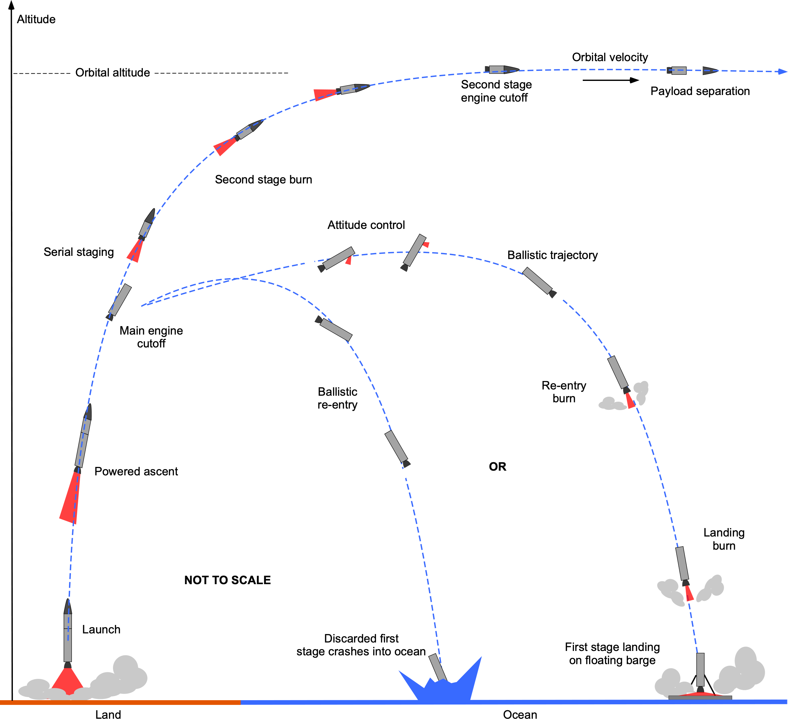
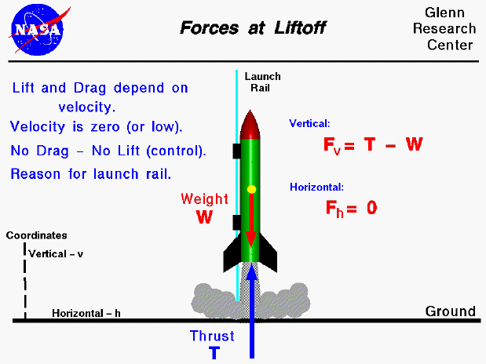
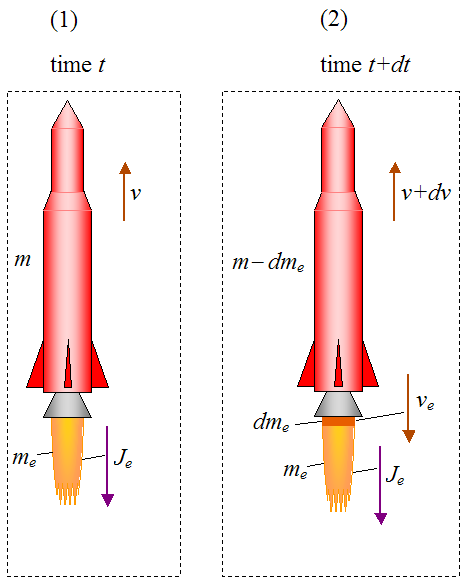
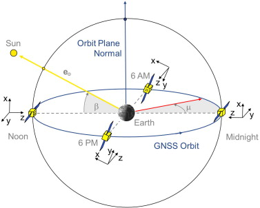

# Apogee

**A two-stage rocket ascent simulator with shooting-method optimization for circular Low Earth Orbit (LEO) insertion.**

<p align="center">
  
</p>

## Project Overview

Apogee is a comprehensive space mission simulator designed to model the complete lifecycle of a satellite deployment mission:

1. **Rocket Launch & Ascent** (✅ Implemented)
   - Two-stage rocket simulation 
   - Shooting method optimization for circular orbit insertion
   - Target altitudes: 160–400 km LEO
   - Payload capacity: 0–10,000 kg

2. **Orbital Insertion** (✅ Implemented)
   - Optimization for minimal eccentricity orbits
   - Two-body orbital diagnostics (apoapsis, periapsis, energy, angular momentum)

3. **Orbital Propagation & Attitude Control** (🔄 Future - `apogee-orbit`)
   - Satellite orbit propagation
   - Solar position calculations
   - Yaw steering optimization for solar panel orientation
   - Power generation modeling

4. **3D Visualization** (🔄 Future - `frontend`)
   - Real-time launch trajectory visualization
   - Orbital path rendering
   - Solar panel attitude animation

### Design Philosophy

The implementation is designed to be:

- **Mathematically rigorous**: Every equation is explicitly derived and mapped to code
- **Numerically robust**: Adaptive RK integration, event root-finding, bounded optimization
- **Physically accurate**: USSA76 atmosphere, variable mass dynamics, non-constant gravity
- **Production-ready**: JSON-serializable output, FastAPI backend, modular architecture
- **Extensible**: Clean separation between physics engine, simulators, and API layers

## Architecture

### Monorepo Structure

Apogee uses a **monorepo with uv workspaces** for dependency management and modular organization:

```text
apogee/
├── packages/                    # Python packages (uv workspace)
│   ├── apogee-physics/         # Pure physics engine (JAX/Diffrax)
│   │   └── src/apogee_physics/
│   │       ├── atmosphere.py   # USSA76 atmosphere model
│   │       ├── dynamics.py     # ODE right-hand side functions
│   │       ├── simulate.py     # Hybrid simulation with events
│   │       ├── orbit.py        # Two-body orbital diagnostics
│   │       ├── shooting.py     # Shooting method solver (LM + Broyden)
│   │       ├── trajectory.py   # Trajectory data structure
│   │       ├── types.py        # Type definitions (dataclasses)
│   │       └── calibration.py  # Vehicle parameter calibration
│   │
│   ├── apogee-launch/          # Launch simulator + CLI
│   │   └── src/apogee_launch/
│   │       ├── simulator.py    # Public API (solve_to_circular_orbit)
│   │       ├── falcon9.py      # Falcon 9 v1.2 FT parameters
│   │       └── cli.py          # Command-line interface (Typer)
│   │
│   ├── apogee-orbit/           # Orbital mechanics (placeholder)
│   │   └── src/apogee_orbit/
│   │       └── (future: propagator, solar, attitude)
│   │
│   └── apogee-api/             # FastAPI REST API
│       └── src/apogee_api/
│           ├── main.py         # FastAPI application
│           ├── routers/        # API endpoints
│           │   ├── launch.py   # Launch simulation endpoints
│           │   └── health.py   # Health check
│           └── schemas/        # Pydantic models
│               └── launch.py   # Request/response schemas
│
├── docs/                        # Documentation & assets
│   ├── nm_final_project.tex    # Mathematical formulation (LaTeX)
│   ├── nm_final_project.pdf    # Compiled math report
│   ├── 2_stages_rocket_launch.png
│   ├── falcon9Trajectory.jpg
│   ├── rocketForces.gif
│   ├── variableMass.png
│   └── general_earth_orbit.png
│
├── pyproject.toml              # Workspace root configuration
├── README.md                   # This file
└── DEVELOPMENT.md              # Development guide
```

### Dependency Flow

```
Frontend (Three.js) [Future]
    ↓
apogee-api (FastAPI)
    ↓
apogee-launch + apogee-orbit
    ↓
apogee-physics (JAX/Diffrax)
```

**Design principle**: Each layer consumes the layer below directly. No logic duplication.

## Mathematical Formulation

### State Vector

The rocket state is described in **planar polar coordinates** (inertial frame):

$$\mathbf{y}(t) = \begin{bmatrix} r(t) \\ \lambda(t) \\ v(t) \\ \gamma(t) \\ m(t) \end{bmatrix}$$

Where:
- **$r(t)$**: Geocentric radius [m]
- **$\lambda(t)$**: Downrange central angle [rad]
- **$v(t)$**: Speed magnitude [m/s]
- **$\gamma(t)$**: Flight-path angle (FPA) from local horizontal [rad]
- **$m(t)$**: Vehicle mass [kg]

Altitude: $h(t) = r(t) - R_E$

<p align="center">
  
</p>

### Equations of Motion

#### Kinematics

$$\frac{dr}{dt} = v \sin(\gamma)$$

$$\frac{d\lambda}{dt} = \frac{v \cos(\gamma)}{r}$$

#### Dynamics

<p align="center">
  
</p>

**Speed equation:**

$$\frac{dv}{dt} = \frac{T}{m}\cos(\alpha) - \frac{D}{m} - \frac{\mu}{r^2}\sin(\gamma)$$

**Flight-path angle equation:**

$$\frac{d\gamma}{dt} = \frac{T}{mv}\sin(\alpha) + \left(\frac{v}{r} - \frac{\mu}{r^2 v}\right)\cos(\gamma)$$

**Mass equation (variable mass):**

<p align="center">
  
</p>

$$\frac{dm}{dt} = -\frac{T}{I_{sp} \cdot g_0}$$

Where:
- **$T$**: Thrust [N]
- **$\alpha$**: Steering angle (thrust vs. velocity) [rad]
- **$D$**: Aerodynamic drag [N]
- **$\mu$**: Earth gravitational parameter [m³/s²]
- **$I_{sp}$**: Specific impulse [s]
- **$g_0$**: Standard gravity (9.80665 m/s²)

**Implementation**: `apogee_physics/dynamics.py::rhs_general`

### Aerodynamic Model

**Mach number:**

$$M = \frac{v}{a_s(h)}$$

**Drag force:**

$$D = \frac{1}{2} \rho(h) C_D(M) A_{ref} v^2$$

**Dynamic pressure:**

$$q = \frac{1}{2} \rho(h) v^2$$

Where:
- **$\rho(h)$**: Atmospheric density from USSA76 [kg/m³]
- **$a_s(h)$**: Speed of sound from USSA76 [m/s]
- **$C_D(M)$**: Drag coefficient (function of Mach number)
- **$A_{ref}$**: Reference area [m²]

**Implementation**: `apogee_physics/atmosphere.py`, `apogee_physics/dynamics.py::compute_derived`

### Hybrid Flight Phases

The ascent is modeled as a **hybrid dynamical system** with event-driven phase transitions:

#### Phase A: Vertical Ascent

- **Constraint**: $\gamma = \pi/2$ (vertical)
- **Event**: Altitude reaches $h_{pitchover}$
- **Action**: Instantaneous pitch-over to $\gamma^+ = \pi/2 - \theta_0$

#### Phase B: Stage-1 Gravity Turn

- **Steering**: $\alpha = 0$ (thrust aligned with velocity)
- **Event**: Mass reaches $m_{1,end}$ (burnout)
- **Action**: Stage separation, mass drop: $m^+ = m^- - m_{1,dry}$

#### Phase C: Coast

- **Dynamics**: $T = 0$, $dm/dt = 0$
- **Duration**: $t_{coast}$ (optimization variable)

#### Phase D: Stage-2 Burn

- **Steering**: $\alpha = \alpha_2$ (constant, optimization variable)
- **Events**: 
  - Time limit: $t = t_{burn2}$
  - Fuel depletion: $m = m_{min} = m_{2,dry} + m_{payload}$
  - Ground impact: $r = R_E$

**Implementation**: `apogee_physics/simulate.py`

### Two-Body Orbital Diagnostics

<p align="center">
  
</p>

At engine cutoff, compute osculating orbital elements:

**Specific orbital energy:**

$$\varepsilon = \frac{v^2}{2} - \frac{\mu}{r}$$

**Specific angular momentum (planar):**

$$h = r v \cos(\gamma)$$

**Eccentricity:**

$$e = \sqrt{\max\left(0, 1 + \frac{2\varepsilon h^2}{\mu^2}\right)}$$

**Semi-major axis (bound orbits, $\varepsilon < 0$):**

$$a = -\frac{\mu}{2\varepsilon}$$

**Apoapsis and periapsis:**

$$r_a = a(1 + e), \quad r_p = a(1 - e)$$

**Implementation**: `apogee_physics/orbit.py::orbit_diagnostics`

## Numerical Methods

### Shooting Method for Circular Orbit Insertion

The circular orbit insertion problem is formulated as a **nonlinear root-finding problem**:

**Decision variables (control vector):**

$$\mathbf{u} = \begin{bmatrix} \theta_0 \\ t_{coast} \\ t_{burn2} \\ \alpha_2 \end{bmatrix}$$

Where:
- **$\theta_0$**: Initial pitch-over angle [deg]
- **$t_{coast}$**: Coast phase duration [s]
- **$t_{burn2}$**: Stage-2 burn time [s]
- **$\alpha_2$**: Stage-2 steering angle [rad]

**Residual function:**

$$\mathbf{F}(\mathbf{u}) = \begin{bmatrix} \frac{a(\mathbf{u}) - r_{target}}{r_{target}} \\ e(\mathbf{u}) \\ \gamma(\mathbf{u}) \end{bmatrix}$$

**Goal**: Find $\mathbf{u}^*$ such that $\mathbf{F}(\mathbf{u}^*) \approx \mathbf{0}$

This ensures:
1. Semi-major axis matches target radius: $a = r_{target}$
2. Orbit is circular: $e = 0$
3. Insertion is tangent: $\gamma = 0$

**Implementation**: `apogee_physics/shooting.py::solve_circular_orbit`

### Optimization Algorithm

The solver uses a **hybrid Levenberg-Marquardt + Broyden method**:

#### 1. Bound Constraints via Logistic Re-parameterization

Physical bounds are enforced:

$$\theta_0 \in [\theta_{min}, \theta_{max}]$$
$$t_{coast} \in [0, 200] \text{ s}$$
$$t_{burn2} \in [50, 450] \text{ s}$$
$$\alpha_2 \in [\alpha_{min}, \alpha_{max}]$$

Introduce unconstrained variables $\mathbf{x} \in \mathbb{R}^4$:

$$u_i(x_i) = u_{i,min} + (u_{i,max} - u_{i,min}) \cdot \sigma(x_i)$$

$$\sigma(x) = \frac{1}{1 + e^{-x}} \quad \text{(logistic function)}$$

**Implementation**: `apogee_physics/shooting.py::_u_from_x`, `_x_from_u`

#### 2. Finite-Difference Jacobian

Compute Jacobian $\mathbf{J} = \frac{\partial \mathbf{F}}{\partial \mathbf{x}}$ using forward differences:

$$\mathbf{J}_{:,i} \approx \frac{\mathbf{F}(\mathbf{x} + \Delta x_i \mathbf{e}_i) - \mathbf{F}(\mathbf{x})}{\Delta x_i}$$

**Implementation**: `apogee_physics/shooting.py::_fd_jacobian_x`

#### 3. Levenberg-Marquardt Step

At iteration $k$, solve damped normal equations:

$$(\mathbf{J}_k^T \mathbf{J}_k + \lambda_k \mathbf{I}) \Delta\mathbf{x}_k = -\mathbf{J}_k^T \mathbf{F}_k$$

Backtracking line search: try step lengths $\alpha \in \{1, \frac{1}{2}, \frac{1}{4}, \ldots\}$ until:

$$\|\mathbf{F}(\mathbf{x}_k + \alpha \cdot \Delta\mathbf{x}_k)\|_2 < \|\mathbf{F}(\mathbf{x}_k)\|_2$$

**Implementation**: `apogee_physics/shooting.py::_newton`

#### 4. Broyden Rank-1 Update

After accepted step $\mathbf{s} = \mathbf{x}_{k+1} - \mathbf{x}_k$ and $\mathbf{y} = \mathbf{F}_{k+1} - \mathbf{F}_k$:

$$\mathbf{J}_{k+1} = \mathbf{J}_k + \frac{(\mathbf{y} - \mathbf{J}_k \mathbf{s})\mathbf{s}^T}{\mathbf{s}^T \mathbf{s}}$$

This reduces expensive residual evaluations while maintaining superlinear convergence.

**Implementation**: `apogee_physics/shooting.py::_broyden_update`

#### 5. Multistart Strategy

Generate candidate initial guesses from coarse grids over each control variable, score by $\|\mathbf{F}(\mathbf{u}_0)\|_2$, and select best initializations.

**Implementation**: `apogee_physics/shooting.py` (candidate generation)

### ODE Integration

Each flight phase is integrated using:

- **Solver**: Tsitouras 5(4) explicit Runge-Kutta (`diffrax.Tsit5`)
- **Step control**: PID controller with adaptive time-stepping
  - Relative tolerance: `rtol = 1e-6`
  - Absolute tolerance: `atol = 1e-6`
- **Event detection**: Newton root-finding (`optimistix.Newton`)
  - Root relative tolerance: `root_rtol = 1e-6`
  - Root absolute tolerance: `root_atol = 1e-3`
- **Saving**: Initial time + all accepted steps

**Implementation**: `apogee_physics/simulate.py::_solve_segment`

### Numerical Regularizations

#### Guard for 1/v singularity

Near liftoff ($v \to 0$), the $\dot{\gamma}$ equation contains $1/v$. Replace:

$$\frac{1}{v} \quad \to \quad \frac{v}{v^2 + v_\varepsilon^2}$$

Matches $1/v$ for $v \gg v_\varepsilon$, bounded at $v = 0$.

**Implementation**: `apogee_physics/dynamics.py::rhs_general` (variable `inv_v`)

#### Guard for 1/r collapse

Prevent numerical issues if $r$ becomes non-physical:

$$r_{safe} = \max(r, 0.99 \cdot R_E)$$

Use $r_{safe}$ in all denominator terms.

**Implementation**: `apogee_physics/dynamics.py::rhs_general` (variable `r_safe`)

#### Time Monotonicity Enforcement

Adaptive solvers and event boundaries can produce non-increasing time samples. Enforce strict monotonicity:

$$t_{k+1} > t_k \quad \forall k$$

by filtering and applying mask to all derived series.

**Implementation**: `apogee_physics/simulate.py::_strictly_increasing_mask`

## Installation

### Prerequisites

- Python ≥ 3.11
- [uv](https://github.com/astral-sh/uv) package manager

### Install

```bash
# Clone repository
git clone <repository-url>
cd apogee

# Install all packages in editable mode
uv sync
```

This installs all workspace packages with proper dependency resolution:
- `apogee-physics`: JAX, Diffrax, ussa1976
- `apogee-launch`: Typer, apogee-physics
- `apogee-orbit`: (placeholder)
- `apogee-api`: FastAPI, Uvicorn, Pydantic, apogee-launch
### Install Specific Package

```bash
uv sync --package apogee-launch
```

## Usage

### Command-Line Interface

Run launch simulations from the terminal:

```bash
# Full trajectory output
uv run apogee-launch --h-target-km 213 --payload-kg 4082

# Summary only (faster, no trajectory arrays)
uv run apogee-launch --h-target-km 213 --payload-kg 4082 --no-trajectory

# Custom initial guesses for shooting solver
uv run apogee-launch --h-target-km 200 --payload-kg 5000 \
  --theta0-deg 8.0 --t-coast 50.0 --t-burn2 300.0

# Pipe to jq for pretty JSON
uv run apogee-launch --h-target-km 213 --payload-kg 4082 --no-trajectory | jq
```

**Required parameters:**
- `--h-target-km`: Target altitude [160, 400] km
- `--payload-kg`: Payload mass [0, 10000] kg

**Optional parameters:**
- `--theta0-deg`: Initial pitch-over angle [deg]
- `--t-coast`: Coast duration [s]
- `--t-burn2`: Stage-2 burn time [s]
- `--no-trajectory`: Exclude trajectory arrays from output

#### JSON Output Schema

```json
{
  "schema_version": 1,
  "inputs": {
    "h_target_km": 213.0,
    "payload_kg": 4082.0
  },
  "optimal_numerics": {
    "theta0_rad": 0.154686,
    "t_coast_s": 5.276867,
    "t_burn2_s": 351.421985,
    "alpha2_rad": 0.113204
  },
  "summary": {
    "ecc": 0.000498,
    "h_err_m": -1644.615,
    "v_err_mps": 1.829968,
    "gamma_deg": -0.025611
  },
  "trajectory": {
    "t_s": [...],
    "r_m": [...],
    "h_m": [...],
    "lambda_rad": [...],
    "v_mps": [...],
    "gamma_rad": [...],
    "m_kg": [...],
    "q_pa": [...],
    "mach": [...],
    "drag_n": [...],
    "pos_m": {"x": [...], "y": [...], "z": [...]},
    "vel_mps": {"x": [...], "y": [...], "z": [...]},
    "orbit": {...}
  }
}
```

All arrays have **explicit unit suffixes** for clarity.

### Python API

Import and use directly in Python scripts:

```python
from apogee_launch import solve_to_circular_orbit

# Run simulation
result = solve_to_circular_orbit(
    h_target_km=213.0,
    payload_kg=4082.0,
    include_trajectory=True,
    trim=True,  # Remove pre-pitchover vertical phase
)

```

**Available functions:**
- `solve_to_circular_orbit()`: Full shooting method optimization
- `simulate_to_orbit()`: Single simulation with given control parameters

### Python API Example with Plotting

```python
from apogee_launch import solve_to_circular_orbit

# Run simulation
result = solve_to_circular_orbit(
    h_target_km=213.0,
    payload_kg=4082.0,
    include_trajectory=True,
    trim=True,  # Remove pre-pitchover vertical phase
)

# Access results
print(f"Eccentricity: {result.summary['ecc']:.6f}")
print(f"Altitude error: {result.summary['h_err_m']:.1f} m")
print(f"Velocity error: {result.summary['v_err_mps']:.3f} m/s")
print(f"Flight-path angle: {result.summary['gamma_deg']:.4f}°")

# Optimal control parameters
print(f"\nOptimal numerics:")
print(f"  θ₀ = {result.optimal_numerics['theta0_rad']:.4f} rad")
print(f"  t_coast = {result.optimal_numerics['t_coast_s']:.2f} s")
print(f"  t_burn2 = {result.optimal_numerics['t_burn2_s']:.2f} s")
print(f"  α₂ = {result.optimal_numerics['alpha2_rad']:.4f} rad")

# Trajectory data (if included)
if result.trajectory:
    import matplotlib.pyplot as plt
    
    t = result.trajectory['t_s']
    h = result.trajectory['h_m']
    v = result.trajectory['v_mps']
    
    plt.figure(figsize=(12, 4))
    plt.subplot(1, 2, 1)
    plt.plot(t, h/1000)
    plt.xlabel('Time [s]')
    plt.ylabel('Altitude [km]')
    plt.grid(True)
    
    plt.subplot(1, 2, 2)
    plt.plot(t, v)
    plt.xlabel('Time [s]')
    plt.ylabel('Velocity [m/s]')
    plt.grid(True)
    
    plt.tight_layout()
    plt.show()
```

### REST API (FastAPI)

Start the development server:

```bash
# Development mode with auto-reload
uv run uvicorn apogee_api.main:app --reload

# Production mode
uv run uvicorn apogee_api.main:app --host 0.0.0.0 --port 8000 --workers 4
```

#### Endpoints

**Health Check:**
```bash
GET http://localhost:8000/health
```

Response:
```json
{"status": "ok", "service": "apogee-api"}
```

**Launch Simulation:**
```bash
POST http://localhost:8000/launch/simulate
Content-Type: application/json

{
  "h_target_km": 213,
  "payload_kg": 4082,
  "include_trajectory": false,
  "theta0_deg": 8.0,  // optional
  "t_coast_s": 50.0,  // optional
  "t_burn2_s": 300.0  // optional
}
```

Response: Same JSON schema as CLI output

**Example with curl:**
```bash
curl -X POST "http://localhost:8000/launch/simulate" \
  -H "Content-Type: application/json" \
  -d '{
    "h_target_km": 213,
    "payload_kg": 4082,
    "include_trajectory": false
  }' | jq
```

**Interactive documentation:**
- Swagger UI: http://localhost:8000/docs
- ReDoc: http://localhost:8000/redoc

## Implementation Details

### Falcon 9 v1.2 FT Parameters

The simulator uses official SpaceX Falcon 9 parameters:

```python
# Vehicle parameters (apogee_launch/falcon9.py)
m0 = 549,054 kg          # Gross liftoff mass
thrust1 = 7,686,000 N    # Stage-1 thrust (9 Merlin 1D)
thrust2 = 981,000 N      # Stage-2 thrust (1 Merlin 1D Vac)
isp1 = 282 s             # Stage-1 specific impulse (sea level)
isp2 = 348 s             # Stage-2 specific impulse (vacuum)
t2_burn = 397 s          # Stage-2 burn time
m1_dry = 22,000 kg       # Stage-1 dry mass
m2_dry = 4,000 kg        # Stage-2 dry mass
interstage = 2,000 kg    # Interstage mass
diameter = 3.7 m         # Vehicle diameter
```

**Reference area:** A_ref = π(d/2)²

**Drag coefficient:** C_D = 0.3 (constant, typical for streamlined rocket)

### Technology Stack

**Physics Engine (`apogee-physics`):**
- [JAX](https://github.com/google/jax): Automatic differentiation, JIT compilation
- [Diffrax](https://github.com/patrick-kidger/diffrax): Differential equation solvers
- [Optimistix](https://github.com/patrick-kidger/optimistix): Root-finding for events
- [ussa1976](https://pypi.org/project/ussa1976/): US Standard Atmosphere 1976

**Launch Simulator (`apogee-launch`):**
- [Typer](https://typer.tiangolo.com/): CLI framework

**REST API (`apogee-api`):**
- [FastAPI](https://fastapi.tiangolo.com/): Modern async web framework
- [Uvicorn](https://www.uvicorn.org/): ASGI server
- [Pydantic](https://pydantic-docs.helpmanual.io/): Data validation

### Code-to-Equation Mapping

| Mathematical Object | Implementation |
|---------------------|----------------|
| Atmosphere table & interpolation | `apogee_physics/atmosphere.py` |
| Derived quantities (h, ρ, M, D, q) | `apogee_physics/dynamics.py::compute_derived` |
| ODE right-hand side | `apogee_physics/dynamics.py::rhs_general` |
| Vertical/gravity turn/coast | `rhs_vertical`, `rhs_gravity_turn`, `rhs_coast` |
| Event functions | `apogee_physics/simulate.py::_cond_*` |
| ODE segment solver | `apogee_physics/simulate.py::_solve_segment` |
| Time monotonicity filter | `apogee_physics/simulate.py::_strictly_increasing_mask` |
| Orbital diagnostics (ε, h, a, e) | `apogee_physics/orbit.py::orbit_diagnostics` |
| Shooting residual | `apogee_physics/shooting.py::compute_residuals` |
| LM step + Broyden + line search | `apogee_physics/shooting.py::_newton` |
| Trajectory JSON serialization | `apogee_physics/trajectory.py::trajectory_to_dict` |

### Performance Characteristics

**Typical convergence:**
- Iterations: 5-15 (depending on initial guess quality)
- Time per simulation: ~0.5-2 seconds (first run includes JAX compilation)
- Subsequent runs: ~0.1-0.5 seconds (cached compilation)

**Accuracy:**
- Altitude error: < 2 km (< 1% for 200 km target)
- Velocity error: < 2 m/s (< 0.03% of orbital velocity)
- Eccentricity: < 0.001 (highly circular)
- Flight-path angle: < 0.1° (nearly tangent insertion)

## Future Work

### Phase 3: Orbital Propagation (`apogee-orbit`)

- [ ] Two-body orbit propagator
- [ ] J2 perturbation (Earth oblateness)
- [ ] Solar position ephemeris
- [ ] Yaw steering optimization for solar panels
- [ ] Power generation modeling

### Phase 4: 3D Visualization (Frontend)

- [ ] Three.js scene setup
- [ ] Real-time launch trajectory rendering
- [ ] Orbital path visualization
- [ ] Solar panel attitude animation
- [ ] Earth texture and lighting
- [ ] Camera controls and viewpoints

**Note:** Trajectory output is already frontend-ready:
- JSON-serializable via `trajectory_to_dict`
- Planar position: `pos_m = {x, y, z}` with z=0
- Compatible with future 3D orbit propagation

## Documentation

**Mathematical formulation:**
- Full derivation: [`docs/nm_final_project.pdf`](docs/nm_final_project.pdf)
- LaTeX source: [`docs/nm_final_project.tex`](docs/nm_final_project.tex)
- Every equation mapped to code implementation

**Development guide:**
- [`DEVELOPMENT.md`](DEVELOPMENT.md): Setup, workflow, best practices

**Visual assets:**
- Falcon 9 reference: `docs/falcon9Rocket.jpg`, `docs/falcon9Trajectory.jpg`
- Diagrams: `docs/2_stages_rocket_launch.png`, `docs/rocketForces.gif`, `docs/variableMass.png`
- Orbital geometry: `docs/general_earth_orbit.png`


## License

[Specify license]

## Acknowledgments

- SpaceX for Falcon 9 technical data
- US Standard Atmosphere 1976 (NOAA/NASA/USAF)
- JAX and Diffrax teams for excellent numerical tools
