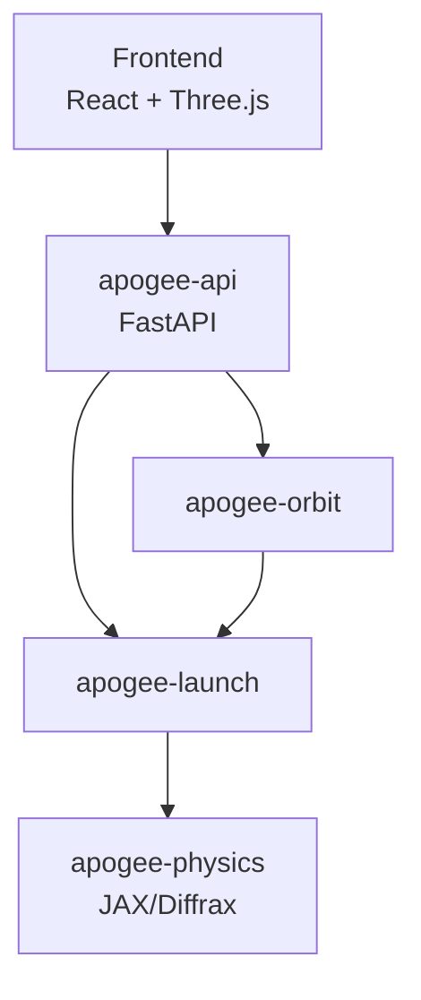

# Architecture

Apogee uses a **monorepo with uv workspaces** for modular organization.

## Directory Structure

```text
apogee/
├── packages/                       # Python packages (uv workspace)
│   ├── apogee-physics/            # Pure physics engine (JAX/Diffrax)
│   │   └── src/apogee_physics/
│   │       ├── atmosphere.py      # USSA76 atmosphere model
│   │       ├── dynamics.py        # ODE right-hand side functions
│   │       ├── simulate.py        # Hybrid simulation with events
│   │       ├── orbit.py           # Two-body orbital diagnostics
│   │       ├── shooting.py        # Shooting method solver
│   │       ├── trajectory.py      # Trajectory data structure
│   │       └── types.py           # Type definitions
│   │
│   ├── apogee-launch/             # Launch simulator + CLI
│   │   └── src/apogee_launch/
│   │       ├── simulator.py       # Public API
│   │       ├── falcon9.py         # Falcon 9 v1.2 FT parameters
│   │       ├── plotting.py        # Visualization
│   │       └── cli.py             # Command-line interface
│   │
│   ├── apogee-orbit/              # Orbital mechanics & yaw steering
│   │   └── src/apogee_orbit/
│   │       ├── core.py            # EquatorialOrbit class
│   │       ├── attitude.py        # Yaw steering algorithm
│   │       ├── simulator.py       # Orbit simulation API
│   │       └── cli.py             # Command-line interface
│   │
│   └── apogee-api/                # FastAPI REST API
│       └── src/apogee_api/
│           ├── main.py            # FastAPI application
│           ├── routers/           # API endpoints
│           └── schemas/           # Pydantic models
│
├── frontend/                       # React Three Fiber 3D visualization
│   └── src/
│       ├── features/              # Feature modules
│       │   ├── beach/             # Launch site scene
│       │   ├── launch/            # Trajectory animation
│       │   └── navigation/        # Intro scenes
│       ├── services/              # API client
│       ├── stores/                # Zustand state
│       └── utils/                 # Coordinate transforms
│
├── docs/                          # This documentation
├── pyproject.toml                 # Workspace root configuration
└── README.md
```

## Dependency Flow



**Design principle**: Each layer consumes the layer below. No logic duplication.

## Package Details

### apogee-physics

The core numerical engine. Pure physics with no CLI or API dependencies.

**Dependencies:**
```toml
dependencies = [
    "jax",
    "diffrax",
    "ussa1976",
]
```

**Key modules:**

| Module | Purpose |
|--------|---------|
| `dynamics.py` | Equations of motion (Eq. 5-14) |
| `atmosphere.py` | USSA76 density and speed of sound |
| `simulate.py` | Hybrid system integration |
| `shooting.py` | Levenberg-Marquardt optimizer |
| `orbit.py` | Orbital element computation |

### apogee-launch

User-facing simulator with Falcon 9 vehicle model.

**Dependencies:**
```toml
dependencies = [
    "apogee-physics",
    "typer>=0.15.0",
    "matplotlib",
]
```

**CLI Entry Point:**
```bash
uv run apogee-launch --h-target-km 200 --payload-kg 5000
```

### apogee-orbit

Orbital propagation and attitude control.

**Dependencies:**
```toml
dependencies = [
    "numpy",
    "typer",
    "matplotlib",
    "apogee-launch",
]
```

**Key features:**

- Circular equatorial orbit propagation
- LVLH coordinate frame
- Yaw steering for solar panels

### apogee-api

REST API for frontend integration.

**Dependencies:**
```toml
dependencies = [
    "fastapi",
    "uvicorn[standard]",
    "pydantic",
    "apogee-launch",
    "apogee-orbit",
]
```

**Endpoints:**

| Endpoint | Method | Purpose |
|----------|--------|---------|
| `/health` | GET | Health check |
| `/launch/simulate` | POST | Run launch simulation |
| `/orbit/trajectory` | POST | Compute orbit trajectory |
| `/orbit/yaw` | POST | Real-time yaw steering |

## Technology Stack

### Backend (Python)

| Technology | Purpose |
|------------|---------|
| [JAX](https://github.com/google/jax) | Automatic differentiation, JIT compilation |
| [Diffrax](https://github.com/patrick-kidger/diffrax) | ODE solvers |
| [Optimistix](https://github.com/patrick-kidger/optimistix) | Root-finding |
| [ussa1976](https://pypi.org/project/ussa1976/) | Atmosphere model |
| [FastAPI](https://fastapi.tiangolo.com/) | REST API framework |
| [Typer](https://typer.tiangolo.com/) | CLI framework |

### Frontend (TypeScript)

| Technology | Purpose |
|------------|---------|
| React 19 | UI framework |
| Three.js | 3D graphics |
| React Three Fiber | React renderer for Three.js |
| Zustand | State management |
| Vite | Build tool |

## Code-to-Equation Mapping

Every equation in the documentation maps to specific code:

| Equation | Description | Code Location |
|----------|-------------|---------------|
| Eq. 1 | State vector | `types.py` |
| Eq. 5-6 | Kinematics | `dynamics.py:69-70` |
| Eq. 9-11 | Dynamics | `dynamics.py:73-82` |
| Eq. 12-14 | Regularization | `dynamics.py:66-79` |
| Eq. 18-21 | Orbital elements | `orbit.py:31-38` |
| Eq. 22-26 | Shooting method | `shooting.py` |

See [Packages](../packages/index.md) for detailed module documentation.
