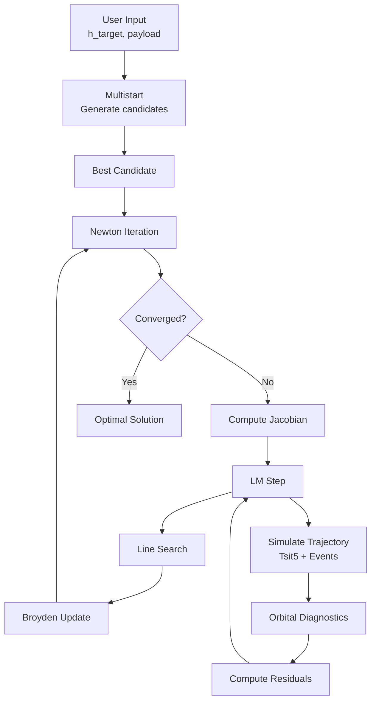

# Numerical Methods

This section covers the numerical algorithms that power the Apogee simulator.

!!! note "LaTeX Reference"
    This section corresponds to **Sections 6 and 8** of `nm_final_project.tex`.

## Overview

The simulator combines three families of numerical methods:

1. **ODE Integration** - Solving the differential equations
2. **Optimization** - Finding optimal control parameters
3. **Numerical Stability** - Handling singularities and edge cases

## Method Summary

| Problem | Method | Package |
|---------|--------|---------|
| Initial Value Problem | Tsitouras 5(4) RK | `diffrax` |
| Event Detection | Newton-Raphson | `optimistix` |
| Trajectory Optimization | Levenberg-Marquardt | Custom |
| Jacobian Approximation | Finite Differences | Custom |
| Jacobian Update | Broyden Rank-1 | Custom |
| Bounded Optimization | Logistic Transform | Custom |

## Topics

### [ODE Integration](ode-integration/index.md)

Solving the equations of motion:

$$
\frac{d\mathbf{y}}{dt} = \mathbf{f}(\mathbf{y}, t)
$$

- [Runge-Kutta Methods](ode-integration/runge-kutta.md) - Explicit RK theory
- [Adaptive Stepping](ode-integration/adaptive-stepping.md) - Error control

### [Optimization](optimization/index.md)

Finding optimal control parameters:

$$
\min_{\mathbf{u}} \|\mathbf{F}(\mathbf{u})\|^2
$$

- [Shooting Method](optimization/shooting-method.md) - Problem formulation
- [Levenberg-Marquardt](optimization/levenberg-marquardt.md) - Damped Gauss-Newton
- [Broyden Update](optimization/broyden-update.md) - Quasi-Newton acceleration

### [Numerical Stability](stability/index.md)

Handling numerical challenges:

- [Singularity Guards](stability/singularity-guards.md) - $1/v$ and $1/r$ regularization

## Algorithm Flow



## Convergence Characteristics

### Typical Performance

| Metric | Value |
|--------|-------|
| Newton iterations | 5-15 |
| Function evaluations | 20-50 |
| Wall-clock time (first run) | ~20 seconds |
| Wall-clock time (subsequent) | ~0.5 seconds |

The first run is slower due to JAX JIT compilation.

### Accuracy

| Metric | Typical Value |
|--------|---------------|
| Eccentricity | < 0.001 |
| Altitude error | < 2 km |
| Velocity error | < 2 m/s |
| FPA at insertion | < 0.1° |

## Key Parameters

### ODE Solver

```python
rtol = 1e-6    # Relative tolerance
atol = 1e-6    # Absolute tolerance
dt0 = 0.5      # Initial step size [s]
max_steps = 100_000
```

### Shooting Method

```python
tol = 1e-6     # Convergence tolerance
max_iter = 30  # Maximum Newton iterations
max_evals = 200  # Maximum function evaluations
```

## References

1. **Stoer, J. & Bulirsch, R.** (2002). *Introduction to Numerical Analysis*. 
   Springer. Chapters 5-7.

2. **Nocedal, J. & Wright, S.** (2006). *Numerical Optimization*. 
   Springer. Chapters 6 and 10.

3. **Hairer, E., Nørsett, S.P., & Wanner, G.** (1993). 
   *Solving Ordinary Differential Equations I*. Springer.

---

## Next Steps

- [Runge-Kutta Methods](ode-integration/runge-kutta.md) - Start with ODE theory
- [Shooting Method](optimization/shooting-method.md) - Core algorithm
