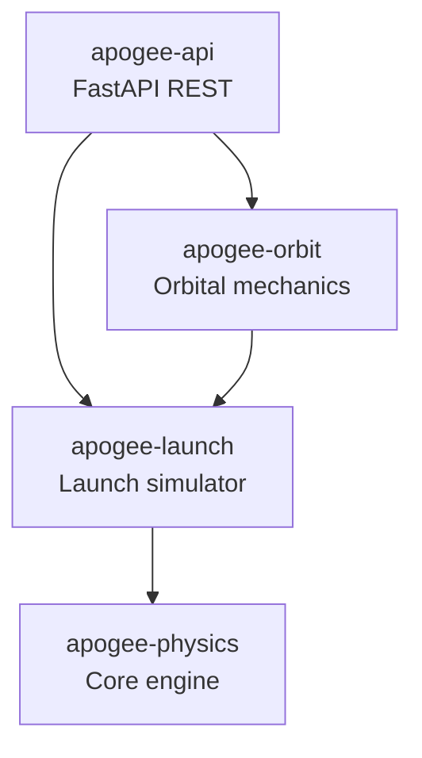

# Packages

Apogee is organized as a monorepo with four packages:



## Package Overview

| Package | Description | Key Modules |
|---------|-------------|-------------|
| [apogee-physics](apogee-physics/index.md) | Core numerical engine | dynamics, shooting, simulate |
| [apogee-launch](apogee-launch/index.md) | Launch simulator + CLI | simulator, falcon9, plotting |
| [apogee-orbit](apogee-orbit/index.md) | Orbital mechanics | core, attitude, simulator |
| [apogee-api](apogee-api/index.md) | REST API | routers, schemas |

## Dependency Graph

```
apogee-physics (JAX, Diffrax, USSA1976)
    ↑
apogee-launch (Typer, Matplotlib)
    ↑
apogee-orbit (NumPy)
    ↑
apogee-api (FastAPI, Pydantic)
```

**Design principle**: Each layer depends only on layers below.

## Code-to-Equation Mapping

| Equation | Description | Location |
|----------|-------------|----------|
| Eq. 1 | State vector | `types.py` |
| Eq. 5-6 | Kinematics | `dynamics.py:69-70` |
| Eq. 9-11 | Dynamics | `dynamics.py:73-82` |
| Eq. 12-13 | Regularization | `dynamics.py:66-77` |
| Eq. 15-16 | Atmosphere | `atmosphere.py` |
| Eq. 18-21 | Orbital elements | `orbit.py:31-38` |
| Eq. 22-26 | Shooting method | `shooting.py` |
