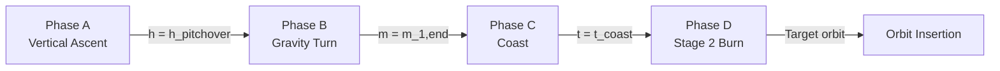

# Flight Phases

The rocket ascent is modeled as a **hybrid dynamical system** with discrete event-driven phase transitions.

!!! note "LaTeX Reference"
    This section corresponds to **Section 5** of `nm_final_project.tex`.

## Overview

The flight consists of four distinct phases:



---

## Phase A: Vertical Ascent

### Constraints

- **Flight-path angle**: $\gamma = \frac{\pi}{2}$ (vertical)
- **Steering angle**: $\alpha = 0$

### Dynamics

With $\gamma$ constrained:

$$
\frac{d\gamma}{dt} = 0, \quad \frac{d\lambda}{dt} = 0
$$

The rocket gains only radial velocity:

$$
\frac{dr}{dt} = v, \quad \frac{dv}{dt} = \frac{T}{m} - \frac{D}{m} - \frac{\mu}{r^2}
$$

### Termination Event

**Condition**: Altitude reaches pitchover height

$$
h(t) = h_{\text{pitchover}} \quad (\approx 500 \text{ m})
$$

### Transition Action

Instantaneous pitchover:

$$
\gamma^+ = \frac{\pi}{2} - \theta_0
$$

Where $\theta_0$ is the **pitchover angle** (optimization variable, typically 5-10°).

**Implementation:**

```python title="apogee_physics/simulate.py" linenums="35"
def _cond_pitch_over(t, y, args, **kwargs):
    """Event: altitude reaches pitchover height."""
    return y[_R] - (args["earth"].r_e + args["h_pitch"])
```

---

## Phase B: Gravity Turn (Stage 1)

### Control Law

**Zero-lift gravity turn**: Thrust aligned with velocity

$$
\alpha = 0
$$

This causes the rocket to naturally arc over due to gravity, achieving efficient trajectory shaping.

### Dynamics

Full equations of motion ([Eq. 5-11](equations-of-motion.md)):

$$
\frac{d\gamma}{dt} = \left(\frac{v}{r} - \frac{\mu}{r^2 v}\right)\cos\gamma
$$

The flight-path angle decreases naturally (γ → 0) as the rocket curves toward horizontal.

### Termination Event

**Condition**: Stage 1 propellant exhausted

$$
m(t) = m_{1,\text{end}} = m_0 - m_{1,\text{prop}}
$$

### Transition Action

**Stage separation**:

$$
m^+ = m^- - m_{1,\text{dry}} - m_{\text{interstage}}
$$

For Falcon 9:
- $m_{1,\text{dry}} = 22{,}000$ kg
- $m_{\text{interstage}} = 2{,}000$ kg

**Implementation:**

```python title="apogee_physics/simulate.py" linenums="40"
def _cond_stage1_burnout(t, y, args, **kwargs):
    """Event: Stage 1 propellant exhausted."""
    return y[_M] - args["m1_end"]
```

---

## Phase C: Coast

### Control

$$
T = 0, \quad \frac{dm}{dt} = 0
$$

The rocket follows a ballistic trajectory with only drag and gravity.

### Dynamics

Simplified equations with $T = 0$:

$$
\frac{dv}{dt} = -\frac{D}{m} - \frac{\mu}{r^2}\sin\gamma
$$

!!! info "Why Coast?"
    The coast phase allows the rocket to gain altitude before Stage 2 ignition,
    improving the efficiency of the final burn.

### Duration

$$
t_{\text{coast}} \in [0, 200] \text{ seconds}
$$

This is an **optimization variable** found by the shooting method.

### Termination

Fixed duration: simulation advances by $t_{\text{coast}}$ seconds.

**Implementation:**

```python title="apogee_physics/dynamics.py" linenums="111"
def rhs_coast(*, t, y, earth, stage, atmos, v_eps):
    """Coast dynamics: T=0 implies dm/dt=0 per LaTeX Report (Section 5.3)."""
    stage0 = StageParams(thrust=0.0, isp=stage.isp, a_ref=stage.a_ref, cd=stage.cd)
    dy = rhs_general(t=t, y=y, earth=earth, stage=stage0, atmos=atmos, alpha=jnp.array(0.0), v_eps=v_eps)
    return dy.at[_M].set(0.0)
```

---

## Phase D: Stage 2 Burn

### Control

$$
\alpha = \alpha_2 \quad (\text{constant steering angle})
$$

The steering angle $\alpha_2$ is an **optimization variable** (typically small, ~1-7°).

### Dynamics

Full equations with Stage 2 parameters:

| Parameter | Falcon 9 Stage 2 |
|-----------|------------------|
| Thrust | 981,000 N |
| $I_{sp}$ | 348 s |
| Dry mass | 4,000 kg |

### Termination Events

The phase ends when **any** of these conditions is met:

1. **Time limit**: $t = t_{\text{burn2}}$ (optimization variable)
2. **Fuel depletion**: $m = m_{2,\text{dry}} + m_{\text{payload}}$
3. **Ground impact**: $r = R_E$ (safety termination)

**Implementation:**

```python title="apogee_physics/simulate.py" linenums="45"
def _cond_fuel_depletion(t, y, args, **kwargs):
    """Event: All propellant exhausted."""
    return y[_M] - args["m_min"]
```

---

## Phase Transition Diagram

```
Time: 0                  ~160s                ~165s              ~520s
      |                    |                    |                  |
      ├────────────────────┼────────────────────┼──────────────────┤
      │                    │                    │                  │
      │   Phase A+B        │     Phase C        │    Phase D       │
      │   Stage 1 Burn     │     Coast          │    Stage 2 Burn  │
      │   T₁ = 7.6 MN      │     T = 0          │    T₂ = 0.98 MN  │
      │                    │                    │                  │
      │                    │  Stage            │                  │
      │                    │  Separation       │                  │
```

---

## Hybrid System Implementation

The simulation orchestrates phase transitions:

```python title="apogee_physics/simulate.py" linenums="218"
def simulate_ascent(config: AscentConfig):
    """Main simulation entry point."""
    
    # Phase A: Vertical ascent
    result_vertical = _solve_segment(
        term=ODETerm(_term_rhs_vertical),
        event=Event(cond_fn=_cond_pitch_over, ...),
        ...
    )
    
    # Apply pitchover
    y_pitched = y_vertical.at[_GAMMA].set(gamma_pitched)
    
    # Phase B: Gravity turn
    result_gravity = _solve_segment(
        term=ODETerm(_term_rhs_gravity_turn),
        event=Event(cond_fn=_cond_stage1_burnout, ...),
        ...
    )
    
    # Apply stage separation
    y_sep = y_gravity.at[_M].set(m_after_sep)
    
    # Phase C: Coast
    result_coast = _solve_segment(
        term=ODETerm(_term_rhs_coast),
        t1=t_gravity + t_coast,
        ...
    )
    
    # Phase D: Stage 2 burn
    result_stage2 = _solve_segment(
        term=ODETerm(_term_rhs_stage2_steer),
        event=combined_events,
        ...
    )
```

---

## Event Detection

Events are detected using **root-finding** on condition functions:

$$
g(t, \mathbf{y}) = 0
$$

The ODE solver:
1. Steps forward until $g$ changes sign
2. Uses Newton-Raphson to find exact zero-crossing
3. Terminates integration at event time

See [Event Detection](../numerical-methods/stability/singularity-guards.md) for details.

---

## Optimization Variables Summary

These four parameters are found by the [Shooting Method](../numerical-methods/optimization/shooting-method.md):

| Variable | Symbol | Typical Range | Units |
|----------|--------|---------------|-------|
| Pitchover angle | $\theta_0$ | 5-12 | degrees |
| Coast duration | $t_{\text{coast}}$ | 0-200 | seconds |
| Stage 2 burn time | $t_{\text{burn2}}$ | 50-450 | seconds |
| Stage 2 steering | $\alpha_2$ | -5 to +10 | degrees |

---

## References

1. **Battin, R.H.** (1999). *An Introduction to the Mathematics and Methods of Astrodynamics*. 
   AIAA Education Series. Chapter 6 - "Rocket Performance".

2. **Curtis, H.D.** (2013). *Orbital Mechanics for Engineering Students*. 
   Butterworth-Heinemann. Chapter 11.

---

## Next Steps

- [Shooting Method](../numerical-methods/optimization/shooting-method.md) - How we find optimal controls
- [Numerical Methods](../numerical-methods/index.md) - ODE integration details
